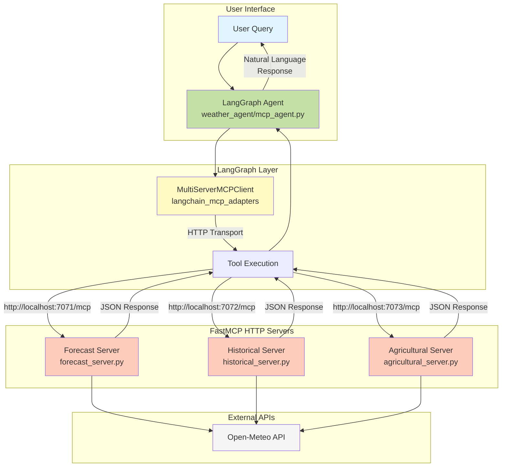

# Proposal: Converting 07-advanced-http-agent to FastMCP HTTP Architecture

## Executive Summary

This proposal outlines the conversion of the 07-advanced-http-agent from stdio subprocess MCP servers to FastMCP HTTP servers, following the patterns established in 06-mcp-http. This progressive step demonstrates how LangGraph can coordinate calling remote MCP servers over HTTP, enabling distributed deployment and better scalability.

## Current Architecture (stdio subprocess)

Currently, the MCP servers in 07-advanced-http-agent run as stdio subprocesses:
- Each server (forecast, historical, agricultural) is a separate Python process
- Communication happens via JSON-RPC over stdin/stdout
- Servers are started by the MultiServerMCPClient with process commands
- Limited to local execution on the same machine

## Proposed Architecture (FastMCP HTTP)

Following the 06-mcp-http pattern, we will:
1. Convert each MCP server to FastMCP with HTTP endpoints
2. Use the official `langchain_mcp_adapters` for LangGraph integration
3. Enable remote server deployment capabilities
4. Maintain all existing functionality with improved architecture

## Architecture Flow Diagram



## Implementation Plan

### 1. Convert MCP Servers to FastMCP

Each server will follow the pattern from 06-mcp-http/serializer.py:

**Example: agricultural_server.py**
```python
from fastmcp import FastMCP
from typing import Optional
from api_utils import get_coordinates, OpenMeteoClient

# Initialize FastMCP server
server = FastMCP(name="openmeteo-agricultural")
client = OpenMeteoClient()

@server.tool
async def get_agricultural_conditions(
    location: str,
    latitude: Optional[float] = None,
    longitude: Optional[float] = None,
    days: int = 7
) -> dict:
    """Get agricultural weather conditions including soil moisture and evapotranspiration.
    
    Args:
        location: Farm location (e.g., 'Ames, Iowa')
        latitude: Optional latitude (overrides location if provided)
        longitude: Optional longitude (overrides location if provided)
        days: Number of forecast days (1-7)
    
    Returns:
        Agricultural conditions data as JSON
    """
    # Implementation remains the same, just return dict instead of MCP response
    # ... existing logic ...
    return data

if __name__ == "__main__":
    server.run(transport="streamable-http", host="127.0.0.1", port=7073, path="/mcp")
```

### 2. Update LangGraph Agent

Modify weather_agent/mcp_agent.py to use HTTP transport:

```python
# Change from stdio to HTTP configuration
server_config = {
    "forecast": {
        "url": "http://127.0.0.1:7071/mcp",
        "transport": "streamable_http"
    },
    "historical": {
        "url": "http://127.0.0.1:7072/mcp", 
        "transport": "streamable_http"
    },
    "agricultural": {
        "url": "http://127.0.0.1:7073/mcp",
        "transport": "streamable_http"
    }
}
```

### 3. Create Server Startup Script

**start_servers.sh**
```bash
#!/bin/bash

# Create logs directory
mkdir -p logs

echo "Starting FastMCP servers..."

# Start forecast server
echo "Starting forecast server on port 7071..."
python mcp_servers/forecast_server.py > logs/forecast_server.log 2>&1 &
echo $! > logs/forecast_server.pid

# Start historical server  
echo "Starting historical server on port 7072..."
python mcp_servers/historical_server.py > logs/historical_server.log 2>&1 &
echo $! > logs/historical_server.pid

# Start agricultural server
echo "Starting agricultural server on port 7073..."
python mcp_servers/agricultural_server.py > logs/agricultural_server.log 2>&1 &
echo $! > logs/agricultural_server.pid

echo "All servers started. Logs available in logs/ directory."
echo "To stop servers, run: ./stop_servers.sh"
```

**stop_servers.sh**
```bash
#!/bin/bash

echo "Stopping FastMCP servers..."

# Stop all servers
for pidfile in logs/*.pid; do
    if [ -f "$pidfile" ]; then
        pid=$(cat "$pidfile")
        echo "Stopping process $pid..."
        kill $pid 2>/dev/null
        rm "$pidfile"
    fi
done

echo "All servers stopped."
```

## Key Benefits

1. **Remote Deployment**: Servers can run on different machines
2. **Scalability**: Each server can be scaled independently
3. **Language Agnostic**: HTTP interface allows polyglot server implementations
4. **Better Debugging**: HTTP requests/responses are easier to inspect
5. **Load Balancing**: Can add multiple instances behind a load balancer

## Migration Steps

1. **Update requirements.txt**: Add `fastmcp` dependency
2. **Convert servers**: Update each server file to use FastMCP decorators
3. **Update agent**: Modify mcp_agent.py to use HTTP configuration
4. **Add scripts**: Create start/stop scripts for server management
5. **Test**: Verify all functionality works with HTTP transport

## Minimal Changes Required

Following the principle of simplicity:
- Only update existing files (no new files except scripts)
- Preserve all existing functionality
- Maintain the same tool interfaces
- Keep the same Pydantic models and structured output

## Testing Plan

1. Start all servers with the script
2. Run existing demos to verify functionality
3. Check logs for any errors
4. Test with the same example queries from stage 05

## Implementation Status

### ✅ Completed Tasks

1. **Created requirements.txt** - Added FastMCP and all necessary dependencies
2. **Converted all MCP servers to FastMCP HTTP**:
   - `forecast_server.py` - Now runs on port 7071
   - `historical_server.py` - Now runs on port 7072
   - `agricultural_server.py` - Now runs on port 7073
3. **Created server management scripts**:
   - `start_servers.sh` - Starts all servers with logging
   - `stop_servers.sh` - Gracefully stops all servers

### 🔄 Ready for Testing

The FastMCP servers are now ready to be tested. To start:

```bash
cd 07-advanced-http-agent
./start_servers.sh
```

The servers will run on:
- Forecast: http://127.0.0.1:7071/mcp
- Historical: http://127.0.0.1:7072/mcp
- Agricultural: http://127.0.0.1:7073/mcp

Logs will be written to:
- `logs/forecast.log`
- `logs/historical.log`
- `logs/agricultural.log`

### 📝 Next Steps

After testing the servers, the next step will be to update the LangGraph agent (`weather_agent/mcp_agent.py`) to use HTTP transport instead of stdio subprocess configuration.

## Conclusion

This conversion demonstrates the natural progression from local stdio MCP servers to distributed HTTP-based FastMCP servers. By following the patterns established in 06-mcp-http, we maintain consistency while showcasing how LangGraph can coordinate remote MCP services, setting the foundation for truly distributed AI applications.