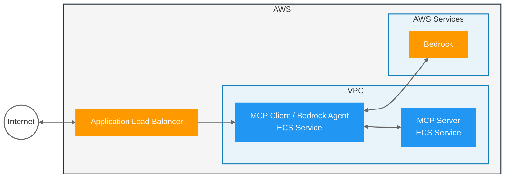

# Sample: MCP Agent with Spring AI and Bedrock

**⚠️ EXPERIMENTAL**: This project demonstrates Spring AI's MCP (Model Context Protocol) integration with AWS Bedrock. It's based on [James Ward's spring-ai-agent-ecs](https://github.com/jamesward/Sample-Model-Context-Protocol-Demos/tree/main/modules/spring-ai-agent-ecs) and modified for potential integration with strands-weather-agent.

**Known Issue**: Spring AI uses Server-Sent Events (SSE) while AWS Strands uses streaming HTTP, which may cause integration challenges.

## What It Does
A Spring Boot application that provides agriculture experts accessible through an AI agent, demonstrating client-server MCP architecture on AWS ECS.



## Setup

1. Setup Bedrock in the AWS Console, [request access to Nova Pro](https://us-east-1.console.aws.amazon.com/bedrock/home?region=us-east-1#/modelaccess)
2. [Setup auth for local development](https://docs.aws.amazon.com/cli/v1/userguide/cli-chap-authentication.html)

### Prerequisites
- Java 21
- Maven
- Docker (for AWS deployment)
- AWS CLI configured with appropriate permissions
- [Rain CLI](https://github.com/aws-cloudformation/rain) (for AWS deployment)

## Quick Start - Docker Development

### Running the MCP Server in Docker

```bash
# Build and run the server container
server/docker-run.sh

# Check server health
curl http://localhost:8081/actuator/health

# View server logs
docker logs -f spring-agriculture-experts

# Stop the server
docker stop spring-agriculture-experts
```

### Running the Client with Docker Server

```bash
# Set the Spring Agriculture Experts server URL to point to Docker container
export SPRING_AGRICULTURE_EXPERTS_URL=http://localhost:8081

# Run the client locally
./mvnw -pl client spring-boot:run

# Test the client API
curl -X POST http://localhost:8080/inquire \
    -H "Content-Type: application/json" \
    -d '{"question": "Get agriculture experts that have skills related to Hydroponics"}'
```

## Run Locally

Before running locally, it's recommended to verify your AWS environment:

**Run `infra/aws-checks.sh`** - Verifies your AWS environment is properly configured:
- Checks AWS CLI authentication and permissions
- Verifies Bedrock access and Nova Pro model availability
- Validates ECR repositories exist
- Tests ECS task execution role permissions

### Start the Applications

Start the MCP Server:
```bash
./mvnw -pl server spring-boot:run
```

Start the MCP Client / Agent:
```bash
./mvnw -pl client spring-boot:run
```

### Test the Application

Make a request to the server REST endpoint:

In IntelliJ, open the `client.http` file and run the request.

Or via `curl`:
```bash
curl -X POST --location "http://localhost:8080/inquire" \
    -H "Content-Type: application/json" \
    -d '{"question": "Get agriculture experts that have skills related to Crop Science"}'
```

Test the new specialty-based recommendation feature:
```bash
curl -X POST --location "http://localhost:8080/inquire" \
    -H "Content-Type: application/json" \
    -d '{"question": "Give me some recommendations from a Pest Management expert"}'
```

```bash
curl -X POST --location "http://localhost:8080/inquire" \
    -H "Content-Type: application/json" \
    -d '{"question": "What are the different types of experties that are available?"}'
```

### API Endpoints

#### Chat with the AI Agent (Client Service - Port 8080)
Query the AI agent that can access agriculture expert tools:
```bash
curl -X POST http://localhost:8080/inquire \
    -H "Content-Type: application/json" \
    -d '{"question": "Find experts with Soil Analysis skills and get a recommendation"}'
```

#### Available MCP Tools
- `getSkills()` - Get all available agriculture skills
- `getAgricultureExpertsWithSkill(skill)` - Find experts with a specific skill
- `getRecommendationFromExpert(expertId)` - Get expert recommendations based on their skills
- `getRecommendationBySpecialty(specialty)` - Get recommendations by specialty without expert ID

## Run on AWS

### Infrastructure Overview

The infrastructure is split into two CloudFormation stacks for faster, more flexible deployments:

1. **Base Stack** (`infra/base.cfn`): VPC, networking, security groups, IAM roles, load balancer (~10 min to deploy)
2. **Services Stack** (`infra/services.cfn`): ECS task definitions and services (~5 min to deploy/update)

This modular approach allows you to:
- Update services without touching base infrastructure (5 min vs 60+ min)
- Debug issues more easily with smaller, focused stacks
- Deploy and test components incrementally

**Note:** If deployment is taking an unusually long time, it's likely that the services deployment has failed. Check the deployment status using `./infra/deploy.sh status` and review the ECS service logs in the AWS Console for troubleshooting.

### Quick Deployment

The easiest way to deploy is using the orchestrated deployment script:

```bash
# 1. Setup ECR repositories
./infra/deploy.sh setup-ecr

# 2. Build and push Docker images
./infra/deploy.sh build-push

# 3. Deploy all infrastructure (base + services)
./infra/deploy.sh all

# 4. Check the deployment worked with 
./infra/test_services.sh 

# For subsequent deployments - just update services after code changes
./infra/deploy.sh update-services

# Check deployment status
./infra/deploy.sh status
```

### Helper Scripts

This project includes several helper scripts in the `infra/` directory:

#### `infra/aws-checks.sh`
Verifies your AWS environment is properly configured:
- Checks AWS CLI authentication and permissions
- Verifies Bedrock access and Nova Pro model availability
- Validates ECR repositories exist
- Tests ECS task execution role permissions

#### `infra/setup-ecr.sh`
Automates ECR repository creation and Docker authentication:
- Creates ECR repositories for both server and client images
- Authenticates Docker with ECR (logs in for docker push)
- Sets up proper repository lifecycle policies
- Provides the ECR_REPO environment variable for builds
- **Important:** Run this script if you get "Your authorization token has expired" errors during docker push

#### `infra/build-push.sh`
Builds and pushes Docker images to ECR:
- Builds Spring Boot Docker images for both server and client
- Tags and pushes images to ECR
- Handles authentication and error checking
- Detects expired authentication tokens and suggests running `setup-ecr.sh`
- **Common failures:** Most push failures are due to expired ECR authentication tokens

#### `infra/test_services.sh`
Tests the deployed services end-to-end:
- Retrieves the load balancer URL from CloudFormation
- Sends a test request to the MCP agent endpoint
- Validates that the services are responding correctly
- Provides immediate feedback on deployment success

#### `infra/deploy.sh`
Main deployment script with the following commands:
- `aws-checks` - Check AWS configuration and Bedrock access
- `setup-ecr` - Setup ECR repositories and Docker authentication
- `build-push` - Build and push Docker images to ECR
- `all` - Deploy all infrastructure (base + services)
- `base` - Deploy only base infrastructure
- `services` - Deploy only services (requires base)
- `update-services` - Update services after code changes
- `status` - Show current deployment status
- `cleanup-services` - Remove services stack only
- `cleanup-base` - Remove base infrastructure
- `cleanup-all` - Remove all infrastructure
- `help` - Show help message

### Manual Deployment (Alternative)

If you prefer to run scripts individually:

1. **Check AWS setup:**
   ```bash
   ./infra/aws-checks.sh
   ```

2. **Setup ECR repositories:**
   ```bash
   ./infra/setup-ecr.sh
   ```

3. **Build and push images:**
   ```bash
   ./infra/build-push.sh
   ```

4. **Deploy infrastructure with Rain:**
   ```bash
   # Deploy base infrastructure
   rain deploy infra/base.cfn spring-ai-mcp-base
   
   # Deploy services
   rain deploy infra/services.cfn spring-ai-mcp-services --params BaseStackName=spring-ai-mcp-base
   ```

### Testing the Deployment

Once deployed, test with:
```bash
# Use the automated test script
./infra/test_services.sh

# Or manually (replace YOUR_LB_HOST with your load balancer URL)
curl -X POST http://YOUR_LB_HOST/inquire \
    -H "Content-Type: application/json" \
    -d '{"question": "Get agriculture experts that have skills related to Sustainable Farming"}'
```