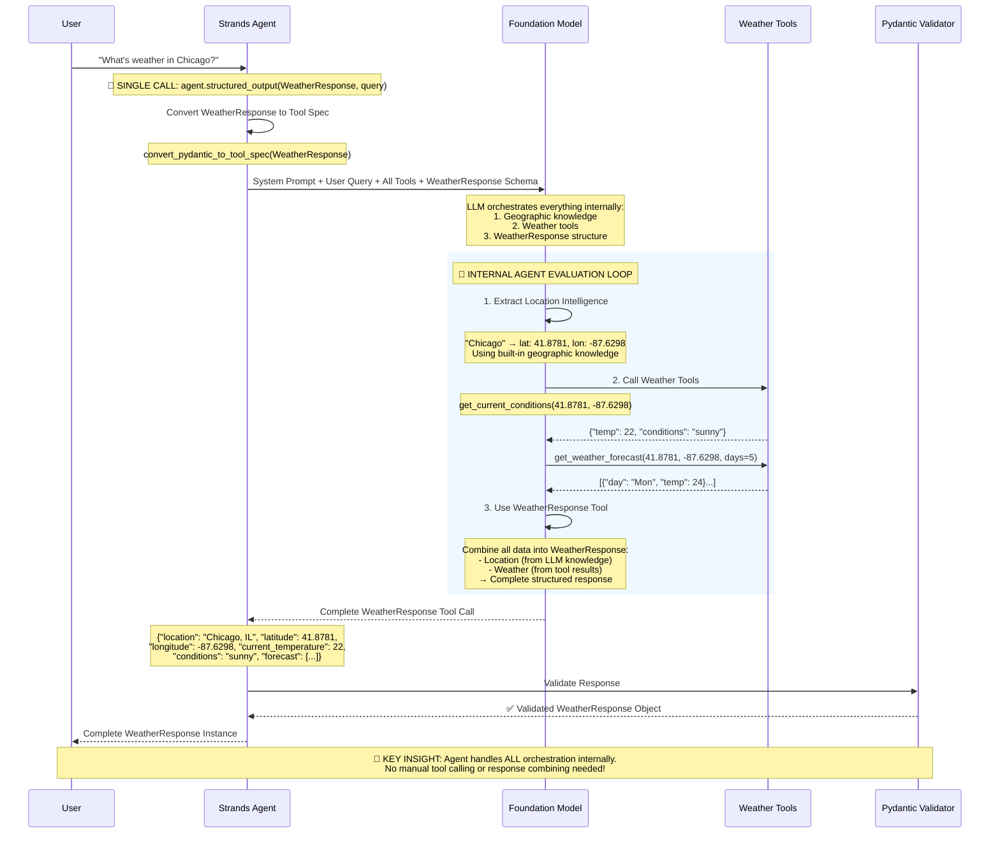

# Comprehensive Guide to Structured Output in AWS Strands

## Executive Summary

This guide demonstrates how to properly implement structured output in AWS Strands Agents, revealing a **fundamental paradigm shift in AI development**: from manual orchestration to agent-driven orchestration.

### 🚀 The Paradigm Shift

**Traditional Development**: You write code to orchestrate between data extraction, API calls, and response formatting.

**AWS Strands Revolution**: You declare the desired output structure, and the agent orchestrates everything internally.

```python
# That's it - one line replaces hundreds of lines of orchestration code!
response = agent.structured_output(WeatherResponse, "What's the weather in Chicago?")
```

### Key Insights

1. **Agent as Orchestrator**: The agent handles the entire workflow internally - no manual tool calling needed
2. **Comprehensive Models**: Use single Pydantic models that describe the complete desired output
3. **Trust Model Intelligence**: Foundation models have extensive knowledge - let them use it
4. **Single API Call**: One structured output call replaces complex multi-stage pipelines
5. **Declarative, Not Imperative**: Describe what you want, not how to get it

This guide will show you how to leverage this paradigm shift to build powerful AI applications with minimal code while maintaining type safety and reliability.

## Table of Contents

1. [Core Philosophy: Trust Foundation Model Intelligence](#core-philosophy-trust-foundation-model-intelligence)
2. [AWS Strands Native Structured Output](#aws-strands-native-structured-output)
3. [Implementation Patterns](#implementation-patterns)
4. [Geographic Intelligence Example](#geographic-intelligence-example)
5. [Best Practices for System Prompts](#best-practices-for-system-prompts)
6. [Validation and Error Handling](#validation-and-error-handling)
7. [Anti-Patterns to Avoid](#anti-patterns-to-avoid)
8. [Production Implementation](#production-implementation)

---

## Core Philosophy: Trust Foundation Model Intelligence

### The Paradigm Shift

AWS Strands embraces **model-driven development**, fundamentally different from traditional imperative programming approaches:

#### ❌ Old Paradigm (Imperative Programming Anti-Patterns)
```python
# Don't do this - classic anti-pattern
def extract_coordinates(location_name):
    # Manual coordinate extraction with regex
    coord_pattern = r'(\d+\.\d+),\s*(-?\d+\.\d+)'
    matches = re.findall(coord_pattern, text)
    
    # Cached city databases
    CITY_COORDINATES = {
        "New York": (40.7128, -74.0060),
        "London": (51.5074, -0.1278),
        # ... hundreds of hardcoded entries
    }
    
    # External geocoding API calls
    if location_name in CITY_COORDINATES:
        return CITY_COORDINATES[location_name]
    else:
        return geocoding_api.get_coordinates(location_name)
```

#### ✅ New Paradigm (Model-Driven Development)
```python
# Do this - trust foundation model intelligence
from strands import Agent
from pydantic import BaseModel, Field

class LocationInfo(BaseModel):
    """Location information extracted directly from LLM knowledge."""
    name: str = Field(..., description="Full location name (City, State/Province, Country)")
    latitude: float = Field(..., ge=-90, le=90, description="Precise latitude coordinate")
    longitude: float = Field(..., ge=-180, le=180, description="Precise longitude coordinate")
    timezone: str = Field(..., description="IANA timezone identifier")
    confidence: float = Field(..., ge=0, le=1, description="LLM confidence in location identification")

# Foundation models have extensive geographical knowledge - USE IT
structured_response = agent.structured_output(LocationInfo, "Extract location info for New York")
# Returns: LocationInfo(name="New York, NY, USA", latitude=40.7128, longitude=-74.0060, ...)
```

### Why This Matters

Foundation models like Claude 3.5 Sonnet have:
- **Comprehensive Geographic Knowledge**: Precise coordinates for cities worldwide
- **Contextual Understanding**: Can disambiguate "Springfield, IL" vs "Springfield, MA"
- **Real-time Reasoning**: No need for cached databases or external APIs
- **Confidence Assessment**: Can indicate uncertainty and request clarification

---

## AWS Strands Native Structured Output

### Core Method: `agent.structured_output()`

AWS Strands provides a native method that handles structured output as the **FINAL response format** after all internal processing is complete. This is crucial to understand:

**🔑 Key Insight**: The structured output is NOT used for initial query processing or tool parameter extraction. Instead, it's the final response format that combines:
1. **LLM Geographic Intelligence** (location extraction from user query)
2. **Tool Execution Results** (actual weather data)
3. **Response Formatting** (structured presentation)

```mermaid
graph TD
    A[User Query: "Weather in Chicago?"] --> B[agent.structured_output call]
    B --> C[Agent Internal Processing]
    
    subgraph "Agent Internal Processing"
        D[1. Geographic Intelligence<br/>Extract: Chicago → 41.8781, -87.6298]
        E[2. Tool Execution<br/>get_weather_data(lat, lon)]
        F[3. Tool Results Analysis<br/>Temperature, conditions, forecast]
        G[4. Use WeatherResponse as Tool<br/>Format final structured response]
        
        D --> E
        E --> F
        F --> G
    end
    
    C --> D
    G --> H[Validated WeatherResponse Object]
    
    style D fill:#e1f5fe
    style E fill:#f3e5f5
    style F fill:#fff3e0
    style G fill:#e8f5e8
```

### Comprehensive Technical Architecture

```mermaid
graph TB
    subgraph "User Request"
        A[User Query: "Weather in Chicago?"]
    end
    
    subgraph "Strands Agent Layer"
        B[agent.structured_output<br/>WeatherResponse, query]
        C[convert_pydantic_to_tool_spec<br/>WeatherResponse → Tool Spec]
        D[Compose LLM Request:<br/>System Prompt + User Query + Tools]
    end
    
    subgraph "Foundation Model Processing"
        E[LLM receives:<br/>• System prompt with instructions<br/>• User query<br/>• Weather tools<br/>• WeatherResponse tool spec]
        
        F[Geographic Intelligence<br/>Extract location coordinates<br/>from internal knowledge]
        
        G[Weather Tool Calls<br/>Execute with coordinates]
        
        H[Response Formatting<br/>Use WeatherResponse "tool"<br/>to structure final output]
    end
    
    subgraph "External Data Sources"
        I[Weather APIs<br/>get_current_conditions<br/>get_forecast]
        J[LLM Geographic Knowledge<br/>Built-in coordinate database<br/>City → Lat/Lon mappings]
    end
    
    subgraph "Response Validation"
        K[Pydantic Validation<br/>Type checking<br/>Constraint validation]
        L[Validated WeatherResponse<br/>Type-safe object]
    end
    
    A --> B
    B --> C
    C --> D
    D --> E
    E --> F
    E --> G
    F -.-> J
    G -.-> I
    F --> H
    G --> H
    H --> K
    K --> L
    
    style F fill:#e1f5fe
    style G fill:#f3e5f5  
    style H fill:#e8f5e8
    style J fill:#fff3e0
    style I fill:#ffebee
```

### Two Distinct Data Sources in WeatherResponse

```python
from strands import Agent
from pydantic import BaseModel
from typing import Optional, List

# FINAL response schema - combines TWO data sources
class WeatherResponse(BaseModel):
    """Structured weather response combining LLM intelligence + tool results."""
    
    # === SOURCE 1: LLM GEOGRAPHIC INTELLIGENCE ===
    # These fields come from LLM's internal knowledge, NOT from tools
    location: str = Field(..., description="Full location name from LLM geographic knowledge")
    latitude: float = Field(..., ge=-90, le=90, description="Precise coordinates from LLM knowledge")
    longitude: float = Field(..., ge=-180, le=180, description="Precise coordinates from LLM knowledge")
    timezone: str = Field(..., description="IANA timezone from LLM knowledge")
    
    # === SOURCE 2: TOOL EXECUTION RESULTS ===
    # These fields come from actual weather tool calls
    current_temperature: Optional[float] = Field(None, description="Temperature from weather API")
    conditions: str = Field(..., description="Weather conditions from weather API")
    forecast: List[dict] = Field(default_factory=list, description="Forecast data from weather API")
    humidity: Optional[int] = Field(None, description="Humidity from weather API")

# Initialize agent with weather tools
agent = Agent(
    model=BedrockModel(model_id="anthropic.claude-3-5-sonnet-20240620-v1:0"),
    tools=[get_weather_forecast, get_current_conditions],  # Actual weather tools
    system_prompt="""You are a weather assistant. 

CRITICAL WORKFLOW:
1. EXTRACT LOCATION: Use your geographic knowledge to get precise coordinates
   - "Chicago" → latitude: 41.8781, longitude: -87.6298
   - "London" → latitude: 51.5074, longitude: -0.1278
   
2. CALL WEATHER TOOLS: Use the coordinates to get actual weather data
   - get_current_conditions(latitude=41.8781, longitude=-87.6298)
   - get_weather_forecast(latitude=41.8781, longitude=-87.6298, days=5)
   
3. STRUCTURED RESPONSE: Combine your geographic knowledge + tool results
   - Location info from YOUR knowledge
   - Weather data from TOOL results"""
)

# Single call handles the entire workflow internally
response = agent.structured_output(
    WeatherResponse, 
    "What's the weather like in Chicago?"
)

# Agent has done ALL the work internally:
# ✅ Extracted Chicago coordinates from LLM knowledge  
# ✅ Called weather tools with those coordinates
# ✅ Formatted results into WeatherResponse structure

print(f"Location: {response.location}")  # From LLM knowledge
print(f"Coordinates: {response.latitude}, {response.longitude}")  # From LLM knowledge  
print(f"Temperature: {response.current_temperature}°C")  # From weather tool
print(f"Conditions: {response.conditions}")  # From weather tool
```

### Detailed Technical Flow



### How It Works Under the Hood

The structured output process involves these key steps:

1. **Tool Spec Generation**: Strands converts your Pydantic model to a Bedrock tool specification:
   ```python
   # Behind the scenes
   from strands.tools.structured_output import convert_pydantic_to_tool_spec
   
   tool_spec = convert_pydantic_to_tool_spec(WeatherResponse)
   # Creates a "tool" that the LLM must use to format its final response
   ```

2. **Multi-Source Processing**: The LLM coordinates between different data sources:
   - **Internal Knowledge**: Geographic intelligence for location extraction
   - **External Tools**: Weather APIs for current data
   - **Response Tool**: WeatherResponse schema for formatting

3. **Schema Enforcement**: The LLM is required to use the WeatherResponse "tool" for its final response, ensuring:
   - All required fields are populated
   - Data types match the schema  
   - Validation constraints are met

4. **Automatic Validation**: Response is validated and instantiated as your Pydantic model:
   ```python
   # The agent returns a fully validated object
   response: WeatherResponse = agent.structured_output(WeatherResponse, query)
   assert isinstance(response, WeatherResponse)  # ✅ Type-safe
   assert response.latitude  # ✅ Required field populated
   assert -90 <= response.latitude <= 90  # ✅ Validation constraints enforced
   ```

### Alternative Pattern: Separate Structured Output Calls (NOT RECOMMENDED)

⚠️ **WARNING**: This pattern breaks the AWS Strands paradigm and should be avoided!

```python
# ❌ ANTI-PATTERN: Manual orchestration defeats the purpose of Strands

class LocationExtraction(BaseModel):
    """Extract location information from user query."""
    location: str = Field(..., description="Full location name")
    latitude: float = Field(..., description="Precise latitude")
    longitude: float = Field(..., description="Precise longitude")
    confidence: float = Field(..., description="Extraction confidence")

class WeatherData(BaseModel):
    """Weather data from tools only."""
    current_temperature: float = Field(..., description="Current temperature")
    conditions: str = Field(..., description="Weather conditions")
    forecast: List[dict] = Field(..., description="Forecast data")

# ❌ Stage 1: Extract location from user query
location_info = agent.structured_output(
    LocationExtraction,
    "What's the weather like in Chicago?"
)

# ❌ Stage 2: Manually call weather tools (breaks agent orchestration)
weather_data = await get_weather_data(
    latitude=location_info.latitude,
    longitude=location_info.longitude
)

# ❌ Stage 3: Manual combination (you're doing the agent's job!)
final_response = {
    **location_info.dict(),
    **weather_data.dict()
}
```

### Why This Anti-Pattern Breaks the Strands Paradigm

1. **Defeats Agent Intelligence**: You're manually doing what the agent should orchestrate
2. **Multiple API Calls**: Increases latency and cost unnecessarily
3. **Lost Context**: Each call loses conversation context and agent memory
4. **Manual Error Handling**: You must handle failures between stages yourself
5. **Imperative Programming**: Returns to traditional coding instead of declarative AI

### The Fundamental Misunderstanding

This pattern represents a **fundamental misunderstanding** of AWS Strands:
- **Wrong**: Treating the agent as a simple extraction tool
- **Right**: Letting the agent orchestrate the entire workflow

The whole point of AWS Strands is that **the agent is the orchestrator**, not your code!

**When to use each approach:**

| Pattern | Use When | Pros | Cons |
|---------|----------|------|------|
| **Single Comprehensive** | Standard weather queries | • Simpler code<br/>• Fewer API calls<br/>• Agent handles coordination | • Less granular control<br/>• Harder to debug intermediate steps |
| **Separate Stages** | Complex workflows<br/>Need intermediate validation<br/>Multiple data sources | • Better error handling<br/>• Intermediate validation<br/>• Modular processing | • More complex code<br/>• Multiple API calls<br/>• Manual coordination |

**💡 Recommendation**: For **agent orchestration** (single `agent.structured_output()` call), use **comprehensive Pydantic classes** that describe the complete desired output. The agent internally handles the coordination between LLM knowledge and tool calls. Separate classes are only needed for **manual orchestration** where you control each step programmatically.

---

## Implementation Patterns

### Pattern 1: Focused Location Extraction (RECOMMENDED)

**Best Practice**: Extract location information ONLY, providing clear guidance to the LLM:

```python
class LocationExtraction(BaseModel):
    """Extract ONLY location information from user query."""
    location_name: str = Field(..., description="Full standardized location name")
    latitude: float = Field(..., ge=-90, le=90, description="Precise latitude from LLM geographic knowledge")
    longitude: float = Field(..., ge=-180, le=180, description="Precise longitude from LLM geographic knowledge")
    timezone: str = Field(..., description="IANA timezone identifier")
    confidence: float = Field(..., ge=0, le=1, description="LLM confidence in location identification")
    needs_clarification: bool = Field(False, description="Whether location is ambiguous and needs clarification")

# Stage 1: Location extraction with clear focus
location_info = agent.structured_output(
    LocationExtraction, 
    "What's the weather like in Chicago?"
)

# The LLM focuses ONLY on geographic intelligence, not weather data
```

### Pattern 2: Focused Query Classification

**Best Practice**: Classify query intent separately from data extraction:

```python
class QueryClassification(BaseModel):
    """Classify ONLY the user's intent - no data extraction."""
    intent: Literal["forecast", "current", "historical", "agricultural"] = Field(
        ..., description="Primary query intent"
    )
    timeframe: Optional[str] = Field(None, description="Requested time period if specified")
    urgency: Literal["low", "medium", "high"] = Field("medium", description="Query urgency level")
    scope: Literal["single_location", "multiple_locations", "region"] = Field(
        "single_location", description="Geographic scope of query"
    )

class WeatherDataRequest(BaseModel):
    """Structure for weather tool responses ONLY - no location extraction."""
    current_temperature: Optional[float] = Field(None, description="Current temperature in Celsius")
    conditions: str = Field(..., description="Weather conditions description")
    humidity: Optional[int] = Field(None, ge=0, le=100, description="Relative humidity percentage")
    forecast_days: List[dict] = Field(default_factory=list, description="Daily forecast data")

# Stage 1: Classify intent
query_type = agent.structured_output(QueryClassification, user_query)

# Stage 2: Extract location (if needed)
if query_type.scope != "no_location":
    location_info = agent.structured_output(LocationExtraction, user_query)

# Stage 3: Get weather data using tools
weather_data = get_weather_tools(location_info.latitude, location_info.longitude)
```

### Pattern 3: Conversation Memory with Structured Output

Maintaining context across multiple structured interactions:

```python
# First interaction - establish context
location_context = agent.structured_output(
    LocationInfo, 
    "I want weather information for my farm in Iowa"
)

# Subsequent interactions use the context
forecast = agent.structured_output(
    WeatherForecast,
    "What's the 5-day forecast?" # Agent remembers Iowa context
)

# The system prompt should include conversation context handling
```

---

## Geographic Intelligence Example

### Enhanced System Prompt for Geographic Intelligence

```python
GEOGRAPHIC_INTELLIGENCE_PROMPT = """You are a weather and agricultural assistant with extensive geographic knowledge.

SCOPE RESTRICTION - CRITICAL SAFETY CHECK:
You ONLY answer queries related to weather and agriculture. If a query is about:
- Non-weather topics (sports, politics, entertainment, etc.)
- Non-agricultural topics (cooking, finance, technology, etc.)
RESPOND: 'I only provide information about weather and agricultural conditions.'

STRUCTURED OUTPUT REQUIREMENTS:
You MUST ALWAYS respond with structured data including:

1. PRECISE COORDINATES: Use your extensive geographical knowledge to provide exact latitude/longitude
   Examples from your knowledge:
   - New York, NY: 40.7128, -74.0060
   - Los Angeles, CA: 34.0522, -118.2437
   - Chicago, IL: 41.8781, -87.6298
   - London, UK: 51.5074, -0.1278
   - Paris, France: 48.8566, 2.3522
   - Tokyo, Japan: 35.6762, 139.6503
   - Sydney, Australia: -33.8688, 151.2093
   - São Paulo, Brazil: -23.5505, -46.6333

2. FULL LOCATION DETAILS: Include city, state/province, country, timezone

3. CONFIDENCE SCORES: Rate your certainty in location identification (0.0-1.0)

GEOGRAPHICAL INTELLIGENCE PRINCIPLES:
- You have comprehensive knowledge of global geography - TRUST AND USE IT
- Provide precise coordinates without external geocoding services
- Handle ambiguous locations by asking for clarification with specific options
- Include timezone and administrative details from your knowledge
- For unclear locations like "Springfield", ask: "Which Springfield do you mean? Springfield, IL; Springfield, MA; Springfield, MO; or another?"

COORDINATE HANDLING FOR TOOLS:
1. ALWAYS call weather tools with the precise coordinates you provide
2. Pass latitude/longitude directly: get_weather_forecast(latitude=40.7128, longitude=-74.0060)
3. This eliminates geocoding delays and improves accuracy
4. Use location names only as display labels in responses

AGRICULTURAL CONTEXT:
- For farming queries, combine weather with soil/growing conditions
- Flag frost warnings, drought conditions, optimal planting windows
- Consider regional growing seasons and crop suitability
- Provide actionable agricultural recommendations

RESPONSE VALIDATION:
- Every location MUST have precise coordinates
- If you cannot determine exact coordinates, ask for clarification
- Always populate all required structured response fields
- Trust your geographic knowledge rather than requesting external lookups
"""
```

### Comprehensive Location Model

```python
class EnhancedLocationInfo(BaseModel):
    """Comprehensive location information leveraging LLM geographic intelligence."""
    
    # Core location data
    name: str = Field(..., description="Full standardized location name (City, State/Province, Country)")
    latitude: float = Field(..., ge=-90, le=90, description="Precise latitude coordinate")
    longitude: float = Field(..., ge=-180, le=180, description="Precise longitude coordinate")
    
    # Administrative details
    country_code: str = Field(..., description="ISO 3166-1 alpha-2 country code (e.g., 'US', 'CA', 'GB')")
    timezone: str = Field(..., description="IANA timezone identifier (e.g., 'America/New_York')")
    region: Optional[str] = Field(None, description="State, province, or major administrative region")
    
    # Quality indicators
    confidence: float = Field(..., ge=0, le=1, description="LLM confidence in location identification")
    ambiguity_resolved: bool = Field(..., description="Whether location ambiguity was resolved")
    
    # Geographic context
    elevation: Optional[int] = Field(None, description="Approximate elevation in meters")
    population_category: Optional[str] = Field(None, description="Population size category: large_city, city, town, village")

class WeatherQueryWithIntelligentLocation(BaseModel):
    """Weather query response with intelligent location extraction."""
    
    # Query understanding
    query_type: str = Field(..., description="Type: current, forecast, historical, agricultural")
    intent_confidence: float = Field(..., ge=0, le=1, description="Confidence in query interpretation")
    
    # Location intelligence
    location: EnhancedLocationInfo = Field(..., description="Extracted and enhanced location information")
    
    # Weather context
    requested_timeframe: str = Field(..., description="Requested time period")
    specific_parameters: List[str] = Field(default_factory=list, description="Specific weather parameters requested")
    
    # Agricultural context (if applicable)
    agricultural_context: Optional[dict] = Field(None, description="Farming-related context if query is agricultural")

# Usage example
response = agent.structured_output(
    WeatherQueryWithIntelligentLocation,
    "What's the weather forecast for planting season in the corn belt around Des Moines?"
)

# The LLM will provide:
# - location.name: "Des Moines, Iowa, United States"
# - location.latitude: 41.5908, location.longitude: -93.6208
# - location.timezone: "America/Chicago"
# - agricultural_context: {"crop": "corn", "activity": "planting", "region": "corn_belt"}
```

---

## Best Practices for System Prompts

### 1. Explicit Geographic Examples

Provide concrete examples to calibrate the LLM's geographic output:

```python
GEOGRAPHIC_EXAMPLES = """
COORDINATE EXAMPLES - Use your knowledge to provide similar precision:
- Major US Cities:
  * New York, NY: 40.7128, -74.0060
  * Los Angeles, CA: 34.0522, -118.2437  
  * Chicago, IL: 41.8781, -87.6298
  * Miami, FL: 25.7617, -80.1918

- International Cities:
  * London, UK: 51.5074, -0.1278
  * Paris, France: 48.8566, 2.3522
  * Tokyo, Japan: 35.6762, 139.6503
  * Sydney, Australia: -33.8688, 151.2093

- Smaller Cities (demonstrate you know these too):
  * Des Moines, IA: 41.5908, -93.6208
  * Boise, ID: 43.6150, -116.2023
  * Burlington, VT: 44.4759, -73.2121
"""
```

### 2. Confidence and Uncertainty Handling

Teach the LLM to handle ambiguity gracefully:

```python
AMBIGUITY_HANDLING = """
HANDLING AMBIGUOUS LOCATIONS:
- If location is ambiguous, provide clarification options:
  * "Springfield" → Ask: "Which Springfield: IL, MA, MO, or another?"
  * "Portland" → Ask: "Portland, Oregon or Portland, Maine?"
  * "Cambridge" → Ask: "Cambridge, MA (Harvard) or Cambridge, UK?"

- For partial information, use context clues:
  * "Silicon Valley weather" → San Jose/Palo Alto, CA area
  * "Weather in wine country" → Context needed: Napa CA, Bordeaux France, etc.

- Confidence scoring guidelines:
  * 1.0: Globally unique location (e.g., "Tokyo, Japan")
  * 0.9: Very clear with context (e.g., "NYC" in US context)
  * 0.7: Likely but could use confirmation (e.g., "Springfield" with state context)
  * 0.5: Multiple possibilities (e.g., "Portland" without state)
  * 0.3 or below: Request clarification
"""
```

### 3. Agricultural Intelligence Integration

For agricultural applications, enhance prompts with domain knowledge:

```python
AGRICULTURAL_INTELLIGENCE = """
AGRICULTURAL GEOGRAPHIC KNOWLEDGE:
- Major Growing Regions (use this knowledge):
  * Corn Belt: Iowa (41.59, -93.62), Illinois (40.63, -89.40), Indiana (39.79, -86.15)
  * Central Valley CA: Fresno (36.75, -119.77), Modesto (37.64, -121.00)
  * Great Plains: Kansas (38.50, -98.00), Nebraska (41.49, -99.90)
  * Wheat Belt: Kansas/Oklahoma border region (37.00, -97.00)

- Climate Considerations:
  * Include USDA Hardiness Zone information when relevant
  * Consider growing degree days (GDD) for crop development
  * Factor in frost dates and growing season length
  * Account for regional precipitation patterns

- Seasonal Context:
  * Spring planting: soil temperature and frost risk critical
  * Growing season: precipitation and temperature monitoring
  * Harvest: weather windows and crop moisture content
  * Winter: soil protection and preparation planning
"""
```

---

## Validation and Error Handling

### Response Validation Pattern

Implement validation to ensure structured output meets requirements:

```python
def validate_structured_response(response: WeatherQueryWithIntelligentLocation) -> ValidationResult:
    """Validate structured response for completeness and accuracy."""
    
    errors = []
    warnings = []
    
    # Validate coordinate presence and range
    if not response.location.latitude or not response.location.longitude:
        errors.append("Missing coordinates - LLM should provide precise lat/lon")
    
    if abs(response.location.latitude) > 90:
        errors.append(f"Invalid latitude: {response.location.latitude}")
    
    if abs(response.location.longitude) > 180:
        errors.append(f"Invalid longitude: {response.location.longitude}")
    
    # Validate confidence levels
    if response.location.confidence < 0.7:
        warnings.append(f"Low location confidence: {response.location.confidence}")
    
    if response.intent_confidence < 0.8:
        warnings.append(f"Uncertain query interpretation: {response.intent_confidence}")
    
    # Validate required fields
    if not response.location.timezone:
        errors.append("Missing timezone information")
    
    if not response.location.country_code:
        errors.append("Missing country code")
    
    return ValidationResult(
        valid=len(errors) == 0,
        errors=errors,
        warnings=warnings
    )

class ValidationResult(BaseModel):
    valid: bool
    errors: List[str] = Field(default_factory=list)
    warnings: List[str] = Field(default_factory=list)
    
    def get_user_message(self) -> Optional[str]:
        """Generate user-friendly error message if validation fails."""
        if not self.valid:
            return (
                "I need more specific location information. Please clarify which exact "
                "location you want weather data for. If this structured output issue "
                "persists, try using a more powerful model like Claude 3.5 Sonnet "
                "for better geographical reasoning."
            )
        return None
```

### Graceful Fallback Implementation

```python
async def get_structured_weather_response(user_query: str) -> Union[WeatherQueryWithIntelligentLocation, str]:
    """Get structured response with fallback to text if validation fails."""
    
    try:
        # Primary: Get structured output
        structured_response = agent.structured_output(
            WeatherQueryWithIntelligentLocation, 
            user_query
        )
        
        # Validate the response
        validation = validate_structured_response(structured_response)
        
        if validation.valid:
            if validation.warnings:
                logger.warning(f"Structured output warnings: {validation.warnings}")
            return structured_response
        
        else:
            # Validation failed - request clarification
            clarification_message = validation.get_user_message()
            return clarification_message
    
    except Exception as e:
        logger.error(f"Structured output failed: {e}")
        
        # Fallback: Get text response
        text_response = agent(f"""
        {user_query}
        
        Note: Please provide location coordinates in your response for more precise weather data.
        """)
        
        return text_response
```

---

## Anti-Patterns to Avoid

### ❌ Don't: Manual Coordinate Extraction

```python
# ANTI-PATTERN: Don't do this
def extract_coordinates_from_text(text: str):
    """This is an anti-pattern - don't extract coordinates manually."""
    import re
    
    # Regex pattern matching - fragile and incomplete
    pattern = r'(\d+\.\d+),\s*(-?\d+\.\d+)'
    matches = re.findall(pattern, text)
    
    # Manual parsing logic - brittle
    for match in matches:
        lat, lon = float(match[0]), float(match[1])
        if -90 <= lat <= 90 and -180 <= lon <= 180:
            return lat, lon
    
    return None, None

# ANTI-PATTERN: Cached coordinate databases
CITY_COORDS = {
    "New York": (40.7128, -74.0060),
    "Los Angeles": (34.0522, -118.2437),
    # ... this approach doesn't scale and is outdated
}
```

### ❌ Don't: External Geocoding Dependencies

```python
# ANTI-PATTERN: Don't rely on external geocoding
import requests

def geocode_location(location_name: str):
    """This is an anti-pattern - LLMs have better geographic knowledge."""
    # External API dependency - adds latency and complexity
    response = requests.get(f"https://api.geocoding.com/v1/search?q={location_name}")
    return response.json()

# Problems with this approach:
# 1. Network dependency and latency
# 2. API rate limits and costs
# 3. Less context awareness than LLMs
# 4. Additional error handling complexity
# 5. Potential data privacy issues
```

### ❌ Don't: Overly Complex Parsing

```python
# ANTI-PATTERN: Complex text parsing instead of structured output
def parse_weather_response(text_response: str):
    """Don't parse text when you can get structured output directly."""
    
    # Fragile text parsing - breaks easily
    lines = text_response.split('\n')
    weather_data = {}
    
    for line in lines:
        if 'temperature' in line.lower():
            # Regex to extract temperature - error-prone
            temp_match = re.search(r'(\d+(?:\.\d+)?)', line)
            if temp_match:
                weather_data['temperature'] = float(temp_match.group(1))
    
    # This approach is fragile and unreliable
    return weather_data

# Instead, use structured output directly!
```

### ✅ Do: Trust LLM Intelligence

```python
# CORRECT PATTERN: Trust foundation model capabilities
class WeatherData(BaseModel):
    location: str = Field(..., description="Full location with coordinates from LLM knowledge")
    latitude: float = Field(..., description="Precise latitude from LLM geographic knowledge")
    longitude: float = Field(..., description="Precise longitude from LLM geographic knowledge")
    temperature: float = Field(..., description="Temperature value")
    conditions: str = Field(..., description="Weather conditions")

# Let the LLM handle geographic intelligence directly
weather_data = agent.structured_output(WeatherData, "What's the weather in Tokyo?")
# LLM provides: location="Tokyo, Japan", latitude=35.6762, longitude=139.6503, ...
```

---

## Production Implementation

### Complete Production-Ready Example

```python
import asyncio
import logging
from typing import Optional, Union
from datetime import datetime
from strands import Agent
from strands.models.bedrock import BedrockModel
from pydantic import BaseModel, Field, validator

# Configure logging
logging.basicConfig(level=logging.INFO)
logger = logging.getLogger(__name__)

class ProductionWeatherResponse(BaseModel):
    """Production-ready structured weather response."""
    
    # Query metadata
    query_id: str = Field(..., description="Unique query identifier")
    timestamp: datetime = Field(default_factory=datetime.utcnow, description="Response timestamp")
    model_used: str = Field(..., description="Foundation model used for response")
    
    # Location intelligence
    location_name: str = Field(..., description="Full standardized location name")
    latitude: float = Field(..., ge=-90, le=90, description="Precise latitude coordinate")
    longitude: float = Field(..., ge=-180, le=180, description="Precise longitude coordinate")
    timezone: str = Field(..., description="IANA timezone identifier")
    country_code: str = Field(..., description="ISO country code")
    
    # Confidence metrics
    location_confidence: float = Field(..., ge=0, le=1, description="Location identification confidence")
    query_confidence: float = Field(..., ge=0, le=1, description="Query interpretation confidence")
    
    # Weather data
    current_temperature: Optional[float] = Field(None, description="Current temperature in Celsius")
    conditions: str = Field(..., description="Weather conditions description")
    humidity: Optional[int] = Field(None, ge=0, le=100, description="Relative humidity percentage")
    wind_speed: Optional[float] = Field(None, ge=0, description="Wind speed in km/h")
    
    # Extended forecast
    forecast_days: int = Field(default=0, description="Number of forecast days provided")
    daily_forecasts: list = Field(default_factory=list, description="Daily forecast data")
    
    # Agricultural context (if applicable)
    agricultural_context: Optional[dict] = Field(None, description="Agricultural recommendations if applicable")
    
    # Quality indicators
    data_sources: list = Field(default_factory=list, description="Data sources used")
    warnings: list = Field(default_factory=list, description="Any warnings or limitations")
    
    @validator('latitude')
    def validate_latitude(cls, v):
        if not -90 <= v <= 90:
            raise ValueError('Latitude must be between -90 and 90')
        return v
    
    @validator('longitude')  
    def validate_longitude(cls, v):
        if not -180 <= v <= 180:
            raise ValueError('Longitude must be between -180 and 180')
        return v

class ProductionWeatherAgent:
    """Production-ready weather agent with structured output."""
    
    def __init__(self, model_id: str = "anthropic.claude-3-5-sonnet-20240620-v1:0"):
        self.model_id = model_id
        self.agent = Agent(
            model=BedrockModel(
                model_id=model_id,
                temperature=0.1,  # Low temperature for consistent structured output
                max_tokens=4000
            ),
            tools=[],  # Add your weather tools here
            system_prompt=self._create_production_system_prompt()
        )
    
    def _create_production_system_prompt(self) -> str:
        """Create production-grade system prompt with comprehensive instructions."""
        return """You are a professional weather and agricultural assistant with extensive geographic knowledge.

SCOPE AND SAFETY:
- You ONLY provide information about weather and agricultural conditions
- Refuse queries about non-weather/agricultural topics politely but firmly
- Always prioritize user safety in weather-related advice

GEOGRAPHIC INTELLIGENCE - CRITICAL:
Your extensive knowledge includes precise coordinates for global locations:

MAJOR CITIES (Examples of your knowledge):
- New York, NY, USA: 40.7128, -74.0060, America/New_York, US
- London, England, UK: 51.5074, -0.1278, Europe/London, GB  
- Tokyo, Japan: 35.6762, 139.6503, Asia/Tokyo, JP
- Sydney, NSW, Australia: -33.8688, 151.2093, Australia/Sydney, AU
- São Paulo, SP, Brazil: -23.5505, -46.6333, America/Sao_Paulo, BR

STRUCTURED OUTPUT REQUIREMENTS:
1. ALWAYS provide precise coordinates from your knowledge
2. Include full location name with administrative details
3. Specify timezone using IANA identifiers
4. Provide confidence scores for location and query interpretation
5. Include relevant agricultural context when applicable

COORDINATE PRECISION STANDARDS:
- Use 4 decimal places for coordinates (e.g., 40.7128, -74.0060)
- Ensure coordinates match the location name exactly
- Double-check coordinate signs (positive/negative) for hemisphere
- Validate coordinates are within valid ranges

AMBIGUITY RESOLUTION:
- For ambiguous locations, request clarification with specific options
- Example: "Springfield" → "Which Springfield: Springfield, IL; Springfield, MA; Springfield, MO; or another?"
- Provide context clues when helpful: "Boston (Massachusetts, USA)" vs "Boston (Lincolnshire, UK)"

AGRICULTURAL INTELLIGENCE:
- Integrate farming calendar and regional growing patterns
- Consider soil temperature, moisture, and growing degree days
- Provide actionable recommendations for planting, growing, harvesting
- Include frost warnings and weather-dependent agricultural advice

QUALITY ASSURANCE:
- Every response MUST include precise coordinates
- Validate all structured fields are populated correctly
- Provide confidence scores reflecting your certainty
- Include warnings for any limitations or uncertainties

TRUST YOUR KNOWLEDGE:
- You have comprehensive global geographic information - use it confidently
- Don't request external geocoding - your knowledge is more accurate and contextual
- Provide immediate, precise responses based on your training data
"""

    async def get_structured_weather(
        self, 
        user_query: str, 
        query_id: Optional[str] = None
    ) -> Union[ProductionWeatherResponse, str]:
        """Get structured weather response with comprehensive error handling."""
        
        if not query_id:
            query_id = f"weather_{datetime.utcnow().strftime('%Y%m%d_%H%M%S')}"
        
        try:
            logger.info(f"Processing weather query {query_id}: {user_query}")
            
            # Get structured output from agent
            response = self.agent.structured_output(
                ProductionWeatherResponse,
                f"""Query ID: {query_id}
Model: {self.model_id}
User Query: {user_query}

Provide comprehensive structured weather information with precise geographic coordinates."""
            )
            
            # Validate response quality
            validation_result = self._validate_response(response)
            
            if validation_result.valid:
                logger.info(f"Successfully generated structured response for query {query_id}")
                if validation_result.warnings:
                    response.warnings.extend(validation_result.warnings)
                return response
            
            else:
                logger.warning(f"Validation failed for query {query_id}: {validation_result.errors}")
                return self._generate_clarification_message(validation_result.errors)
        
        except Exception as e:
            logger.error(f"Error processing query {query_id}: {e}")
            return f"I encountered an error processing your weather request. Please try rephrasing your query or contact support with query ID: {query_id}"
    
    def _validate_response(self, response: ProductionWeatherResponse) -> ValidationResult:
        """Comprehensive validation of structured response."""
        errors = []
        warnings = []
        
        # Coordinate validation
        if not response.latitude or not response.longitude:
            errors.append("Missing geographic coordinates")
        
        # Confidence validation
        if response.location_confidence < 0.7:
            warnings.append(f"Low location confidence: {response.location_confidence}")
        
        if response.query_confidence < 0.8:
            warnings.append(f"Uncertain query interpretation: {response.query_confidence}")
        
        # Required field validation
        required_fields = ['location_name', 'timezone', 'country_code', 'conditions']
        for field in required_fields:
            if not getattr(response, field):
                errors.append(f"Missing required field: {field}")
        
        return ValidationResult(valid=len(errors) == 0, errors=errors, warnings=warnings)
    
    def _generate_clarification_message(self, errors: list) -> str:
        """Generate user-friendly clarification message."""
        return (
            "I need more specific location information to provide accurate weather data. "
            "Please specify the exact city, state/province, and country you're interested in. "
            "For example: 'Chicago, Illinois, USA' or 'London, England, UK'. "
            f"Technical details: {'; '.join(errors)}"
        )

# Usage example
async def main():
    """Example usage of production weather agent."""
    
    weather_agent = ProductionWeatherAgent()
    
    test_queries = [
        "What's the weather like in Chicago?",
        "Give me a 5-day forecast for London",
        "Are conditions good for planting corn in Iowa?",
        "What's the weather at 40.7128, -74.0060?",  # NYC coordinates
    ]
    
    for query in test_queries:
        print(f"\nQuery: {query}")
        result = await weather_agent.get_structured_weather(query)
        
        if isinstance(result, ProductionWeatherResponse):
            print(f"✅ Location: {result.location_name}")
            print(f"✅ Coordinates: {result.latitude}, {result.longitude}")
            print(f"✅ Conditions: {result.conditions}")
            if result.warnings:
                print(f"⚠️ Warnings: {result.warnings}")
        else:
            print(f"❌ Error/Clarification: {result}")

if __name__ == "__main__":
    asyncio.run(main())
```

---

## Key Takeaways

### 1. **Trust Foundation Model Intelligence**
- Modern LLMs have extensive, accurate geographic knowledge
- Eliminate manual coordinate extraction and external geocoding
- Let the model handle geographic reasoning directly

### 2. **Use Native Strands Capabilities**
- `agent.structured_output()` provides type-safe, validated responses
- Built-in Pydantic integration ensures schema compliance
- Tool-based approach guarantees structured output format

### 3. **Design Comprehensive System Prompts**
- Provide explicit geographic examples and coordinate formats
- Include confidence scoring and ambiguity handling instructions
- Integrate domain-specific knowledge (agricultural contexts)

### 4. **Implement Robust Validation**
- Validate coordinate ranges and required fields
- Provide clear user feedback for ambiguous queries
- Implement graceful fallback mechanisms

### 5. **Embrace Model-Driven Development**
- Move beyond imperative programming patterns
- Trust and leverage foundation model capabilities
- Focus on prompt engineering rather than manual data processing

This guide demonstrates how AWS Strands enables powerful, reliable structured output that leverages the full capabilities of modern foundation models while maintaining type safety and production readiness.