# Strands Weather Agent - Model-Agnostic AI Agent with AWS Strands

## 🚀 Paradigm Shift: Agent-Driven Orchestration

This example demonstrates how to properly implement structured output with AWS Strands Agents, revealing a **fundamental paradigm shift in AI development**: from manual orchestration to agent-driven orchestration.

### Traditional Development (Old Way)
You write hundreds of lines of code to:
- Extract location from user query
- Look up coordinates in a database
- Call weather APIs with those coordinates
- Format the response
- Handle errors at each step

### AWS Strands Revolution (New Way)
You declare the desired output structure, and the agent orchestrates everything internally:

```python
# That's it - one line replaces hundreds of lines of orchestration code!
response = agent.structured_output(WeatherResponse, "What's the weather in Chicago?")
```

The agent automatically:
- ✅ Extracts "Chicago" from the query using LLM intelligence
- ✅ Knows Chicago's coordinates (41.8781, -87.6298) from its training
- ✅ Calls weather tools with those coordinates
- ✅ Formats the response according to your schema
- ✅ Validates all data types and constraints

### Why This Matters

**Significant Code Reduction**: Eliminate manual orchestration, coordinate lookups, and response formatting  
**No External APIs**: LLMs have geographic knowledge built-in - no geocoding needed  
**Type Safety**: Pydantic models ensure structured, validated responses  
**Single API Call**: One method replaces complex multi-stage pipelines

### Key Insights

1. **Agent as Orchestrator**: The agent handles the entire workflow internally - no manual tool calling needed
2. **Comprehensive Models**: Use single Pydantic models that describe the complete desired output
3. **Trust Model Intelligence**: Foundation models have extensive knowledge - let them use it
4. **Single API Call**: One structured output call replaces complex multi-stage pipelines
5. **Declarative, Not Imperative**: Describe what you want, not how to get it
6. **Calibrate, Don't Teach**: Examples in prompts should demonstrate output format and completeness, not provide facts the model already knows

This paradigm shift enables you to build powerful AI applications with minimal code while maintaining type safety and reliability. For a deep dive into these concepts, see our [Comprehensive Guide to Structured Output](GUIDE_STRUCTURED_OUTPUT_STRANDS.md).

## Overview

This project demonstrates how to build model-agnostic AI agent systems using **AWS Strands** for orchestration, **FastMCP** for distributed tool servers, and **AWS Bedrock** for foundation models. It showcases a streamlined multi-service architecture: **User → Agent → MCP Servers → Weather APIs**.

This demonstration showcases:
- **True Model Agnosticism**: Switch between Claude, Llama, Cohere, and Amazon Nova models via environment variable
- **Zero Code Changes Required**: Model selection happens entirely through configuration
- **Docker Containerized**: Ready for local development and AWS ECS deployment
- **Distributed Architecture**: Multiple MCP servers for different data domains
- **Real Weather Data**: Integration with Open-Meteo API for live weather information (no API key required)
- **50% Less Code**: Compared to traditional orchestration frameworks like LangGraph

## Why AWS Strands? The Next Evolution

### 🚀 Rapid Agent Development with Strands

**AWS Strands**: Native MCP integration with automatic tool discovery and simplified agent creation.

Instead of complex orchestration code, AWS Strands provides:
- Built-in MCP client support - no custom wrappers needed
- Automatic tool discovery from MCP servers
- Native streaming and session management

### Core Simplification

```python
# That's it! AWS Strands handles everything else
from strands import Agent

agent = Agent(
    name="weather-assistant",
    foundation_model_config={"model_id": model_id},
    mcp_servers=mcp_servers
)
```

## Quick Start

### Prerequisites

✅ **Docker** installed and running  
✅ **AWS CLI** configured with credentials (`aws configure`)  
✅ **AWS Account** with Bedrock access enabled  
✅ **Python 3.12** (for direct Python execution)

### Local Development: Docker (FastAPI Web Server)

Run the weather agent as a web API server with all services containerized:

```bash
# 1. Configure AWS Bedrock model
cp .env.example .env
# Edit .env and set BEDROCK_MODEL_ID

# 2. Start all services with AWS credentials
./scripts/start_docker.sh

# 3. Test the services
./scripts/test_docker.sh

# 4. Stop services when done
./scripts/stop_docker.sh
```

### Local Development: Direct Python Execution (Interactive Chatbot)

Run the weather agent as an interactive chatbot:

```bash
# 1. Configure AWS Bedrock access
./scripts/aws-setup.sh

# 2. Start MCP servers (runs in background)
./scripts/start_servers.sh

# 3. Navigate to weather agent directory
cd weather_agent

# 4. Set Python version and install dependencies
pyenv local 3.12.10
pip install -r requirements.txt

# 5. Run the interactive chatbot
python chatbot.py                    # Interactive mode
python chatbot.py --demo             # Demo mode with example queries
python chatbot.py --multi-turn-demo  # Multi-turn conversation demo

# 6. Stop servers when done (from project root)
cd .. && ./scripts/stop_servers.sh
```

### API Examples (Docker/Web Server Mode)

When running with Docker, the weather agent runs as a FastAPI web server. Test it with HTTP requests:

```bash
# Health check
curl http://localhost:7777/health

# Get weather forecast
curl -X POST http://localhost:7777/query \
  -H "Content-Type: application/json" \
  -d '{"query": "What is the weather forecast for Seattle?"}'

# Get structured weather data
curl -X POST http://localhost:7777/query/structured \
  -H "Content-Type: application/json" \
  -d '{"query": "Show me the temperature in Chicago"}'

# Check MCP server connectivity
curl http://localhost:7777/mcp/status
```

### AWS ECS Deployment

```bash
# 1. Navigate to infrastructure directory
cd infra

# 2. Deploy everything to AWS ECS
./deploy.sh all

# 3. Get the application URL
./deploy.sh status

# The deployment will:
# - Create ECR repositories
# - Build and push Docker images
# - Deploy VPC, ECS cluster, and ALB
# - Deploy all services with auto-scaling
```

### Deployment Options

```bash
# Deploy with specific model
BEDROCK_MODEL_ID="anthropic.claude-3-haiku-20240307-v1:0" ./infra/deploy.sh all

# Individual deployment steps
./infra/deploy.sh setup-ecr        # Create ECR repositories
./infra/deploy.sh build           # Build Docker images
./infra/deploy.sh push            # Push images to ECR
./infra/deploy.sh deploy-base     # Deploy VPC, ECS cluster, ALB
./infra/deploy.sh deploy-services # Deploy application services
./infra/deploy.sh status          # Check deployment status
./infra/deploy.sh cleanup         # Remove all resources
```

## Architecture

### System Design

```mermaid
graph TB
    User["👤 User Request"] --> ALB["Application Load<br/>Balancer (ALB)"]
    
    ALB --> WA["Weather Agent Service<br/>(AWS Strands + FastAPI)"]
    
    WA --> Bedrock["AWS Bedrock<br/>(Foundation Models)"]
    WA --> SD["MCP Service Discovery<br/>(Internal: *.local)"]
    
    SD --> FS["Forecast Server<br/>(Port 7778)"]
    SD --> HS["Historical Server<br/>(Port 7779)"]
    SD --> AS["Agricultural Server<br/>(Port 7780)"]
    
    FS --> OM["Open-Meteo API<br/>(Weather Data)"]
    HS --> OM
    AS --> OM
    
    style User fill:#e1f5ff,stroke:#0288d1,stroke-width:2px
    style ALB fill:#fff3e0,stroke:#ff6f00,stroke-width:2px
    style WA fill:#e8f5e9,stroke:#388e3c,stroke-width:3px
    style SD fill:#f3e5f5,stroke:#7b1fa2,stroke-width:2px
    style FS fill:#fce4ec,stroke:#c2185b,stroke-width:2px
    style HS fill:#fce4ec,stroke:#c2185b,stroke-width:2px
    style AS fill:#fce4ec,stroke:#c2185b,stroke-width:2px
    style Bedrock fill:#fff8e1,stroke:#f57c00,stroke-width:2px
    style OM fill:#e3f2fd,stroke:#1976d2,stroke-width:2px
```



**Note**: All components run as containerized services in AWS ECS with auto-scaling, health monitoring, and CloudWatch logging.

**Key Advantages over LangGraph:**
- **Native MCP Client**: No custom HTTP clients or tool wrappers
- **Automatic Discovery**: Tools discovered at runtime from MCP servers
- **Built-in Streaming**: Response streaming handled by Strands
- **Session Management**: Conversation state managed automatically

### Component Details

1. **FastMCP Servers** (Distributed Tool Servers):
   - **Forecast Server**: 5-day weather forecasts via Open-Meteo API
   - **Historical Server**: Past weather data and trends
   - **Agricultural Server**: Crop recommendations and frost risk analysis

2. **AWS Strands Agent**:
   - Native MCP integration without custom wrappers
   - Automatic tool discovery and execution
   - Built-in conversation memory and streaming
   - Structured output with type validation

3. **FastAPI Application**:
   - RESTful API for query submission
   - Health monitoring endpoints
   - Session management endpoints
   - Structured request/response models

### Data Flow

1. User submits natural language query via REST API
2. AWS Strands agent analyzes intent and determines required tools
3. Agent discovers available tools from MCP servers via native protocol
4. Agent executes tools with appropriate parameters
5. Responses automatically formatted and streamed back to user

## Key Features & Benefits

### AWS Strands Advantages

1. **Significant Less Code**: Compare our `mcp_agent.py` to LangGraph implementations
2. **Native MCP**: No custom HTTP clients or tool wrappers
3. **Automatic Discovery**: Tools found at runtime
4. **Built-in Features**: Streaming, sessions, error handling

### Key Capabilities

- **Health Checks**: All services monitored with custom health endpoints
- **Structured Logging**: JSON logs for analysis
- **Error Handling**: Graceful degradation
- **Auto-scaling**: ECS handles load automatically
- **Multi-turn Conversations**: Context retention across queries
- **Structured Output**: Type-safe responses with Pydantic models

### Developer Experience

- **One-command Operations**: Scripts handle complexity
- **AWS Credential Magic**: Works with any auth method (SSO, profiles, IAM roles)
- **Comprehensive Testing**: Unit and integration tests
- **Clear Documentation**: In-code and README guides
- **Local Development**: Run with Python or Docker
- **Quick Demos**: Interactive chatbot and API modes

## Example Queries

The system handles various types of weather and agricultural queries:

### Weather Queries
- "What's the weather like in Chicago?"
- "Give me a 5-day forecast for Seattle"
- "What were the temperatures in New York last week?"
- "Compare the weather between Miami and Denver"
- "Weather at coordinates 40.7128, -74.0060"

### Agricultural Queries  
- "Are conditions good for planting corn in Iowa?"
- "What's the frost risk for tomatoes in Minnesota?"
- "Best time to plant wheat in Kansas?"
- "Soil conditions for vineyards in Napa Valley?"

### Multi-Turn Context Examples
- **Turn 1:** "Weather in Portland"
- **Turn 2:** "How about Seattle?" (compares to Portland)
- **Turn 3:** "Which is better for farming?" (considers both cities)

### Structured Output Examples
The structured output preserves all geographic intelligence and weather data:

```python
# Returns WeatherQueryResponse with:
# - query_type: "current", "forecast", "historical", "agricultural"
# - locations: [ExtractedLocation(...)] with precise coordinates
# - weather_data: WeatherDataSummary with conditions
# - agricultural_assessment: Agricultural recommendations (if applicable)
# - processing_time_ms: Response timing
```

## Demo and Testing

### Running Interactive Demos

#### 1. Simple Interactive Chatbot
```bash
# Start MCP servers and run chatbot
./scripts/start_servers.sh
python -m weather_agent.main               # Interactive mode
python -m weather_agent.main --demo        # Demo mode with examples
./scripts/stop_servers.sh
```

#### 2. Multi-Turn Conversation Demos 🎯 **NEW - Context Retention**
```bash
# Basic multi-turn conversation demo
python -m weather_agent.demo_scenarios

# Context switching demo (advanced scenarios)
python -m weather_agent.demo_scenarios --context-switching

# Show detailed tool calls during demo
python -m weather_agent.demo_scenarios --structured
```

**What the multi-turn demos showcase:**
- **Turn 1:** "What's the weather like in Seattle?"
- **Turn 2:** "How does it compare to Portland?" (remembers Seattle)
- **Turn 3:** "Which city would be better for outdoor activities?" (remembers both cities)
- **Turn 4:** Agricultural queries with location context
- **Turn 5:** Comprehensive summaries using accumulated context


#### 4. Context Retention Testing 🧪 **NEW**
```bash
# Comprehensive context retention test suite
python test_context_retention.py

# Expected output:
# 🎉 All Tests Completed Successfully!
# ✅ Basic context retention: PASSED
# ✅ Context switching: PASSED  
# ✅ Structured output context: PASSED
# ✅ Session management: PASSED
```

### Running Test Suites

```bash
# Comprehensive testing with one command
./scripts/run_tests.sh

# With Docker integration tests
./scripts/run_tests.sh --with-docker

# Quick test of core functionality
./scripts/test_agent.sh

# Run specific test modules
python -m pytest tests/test_mcp_servers.py -v
python -m pytest tests/test_weather_agent.py -v
python -m pytest tests/test_coordinates_consolidated.py -v
```

## API Usage

### REST API Endpoints

```bash
# Health check
curl http://localhost:7777/health

# Simple query
curl -X POST http://localhost:7777/query \
  -H "Content-Type: application/json" \
  -d '{"query": "What is the weather like in Chicago?"}'

# Structured output query
curl -X POST http://localhost:7777/query/structured \
  -H "Content-Type: application/json" \
  -d '{"query": "What is the weather like in Seattle?"}'

# Multi-turn conversation with session
curl -X POST http://localhost:7777/query \
  -H "Content-Type: application/json" \
  -d '{"query": "What is the weather in Denver?", "session_id": "conversation_1"}'

curl -X POST http://localhost:7777/query \
  -H "Content-Type: application/json" \
  -d '{"query": "How does it compare to Phoenix?", "session_id": "conversation_1"}'

# Session management endpoints
curl http://localhost:7777/session/conversation_1         # Get session info
curl -X DELETE http://localhost:7777/session/conversation_1  # Clear session
curl http://localhost:7777/mcp/status                     # Check MCP server status
```


## AWS Deployment Guide

### Infrastructure Overview

The deployment creates AWS infrastructure using CloudFormation:

#### Base Infrastructure (`infra/base.cfn`)
- **Networking**: VPC with 2 public subnets across availability zones
- **Load Balancing**: Application Load Balancer with health checks
- **ECS Cluster**: Fargate-based cluster with Container Insights
- **Service Discovery**: Private DNS namespace (weather.local)
- **Security**: Security groups and IAM roles with least-privilege

#### Services Infrastructure (`infra/services.cfn`)
- **ECS Services**: 4 services (1 agent + 3 MCP servers)
- **Task Definitions**: Resource limits and environment configuration
- **Service Connect**: Internal service mesh for communication
- **CloudWatch Logs**: Log groups with 7-day retention
- **Auto-scaling**: Optional scaling policies based on CPU/memory

### AWS Infrastructure Details

1. **Networking**:
   - VPC with public/private subnets across 2 AZs
   - Internet Gateway for outbound connectivity
   - Security groups for ALB and services

2. **ECS Cluster**:
   - Fargate launch type (serverless containers)
   - Container Insights enabled
   - Auto-scaling policies

3. **Services**:
   - 4 ECS services (agent + 3 MCP servers)
   - Service discovery for internal communication
   - Health checks for reliability

4. **Load Balancing**:
   - Application Load Balancer for external access
   - Target group with health checks
   - Auto-assigned DNS name

5. **Storage**:
   - ECR repositories for Docker images
   - CloudWatch Log Groups for each service

6. **Security**:
   - IAM roles with least-privilege access
   - No hardcoded credentials
   - VPC isolation for services

### Deployment Process

```bash
# One command deployment
./infra/deploy.sh all

# Or step-by-step:
./infra/deploy.sh setup-ecr      # Create repositories
./infra/deploy.sh build-push     # Build and push images
./infra/deploy.sh base           # Deploy infrastructure
./infra/deploy.sh services       # Deploy ECS services
```

### Monitoring & Updates

```bash
# Check deployment status
./infra/status.sh

# Update after code changes
./infra/deploy.sh update

# View logs
./infra/logs.sh weather-agent
```

### Infrastructure Scripts

| Script | Purpose | Usage |
|--------|---------|-------|
| `deploy.sh` | Main orchestrator | `deploy.sh [all\|base\|services\|update]` |
| `aws-checks.sh` | Verify prerequisites | Run before first deploy |
| `test_services.sh` | Test deployment | Validates all endpoints |
| `status.sh` | Deployment status | Shows health and URLs |
| `logs.sh` | View CloudWatch logs | `logs.sh [service-name]` |

## Configuration

### Environment Variables

Create a `.env` file with:

```bash
# Required - AWS Bedrock Model
BEDROCK_MODEL_ID=amazon.nova-lite-v1:0  # or any supported model
BEDROCK_REGION=us-east-1

# Optional
BEDROCK_TEMPERATURE=0
LOG_LEVEL=INFO
SYSTEM_PROMPT=default  # or 'agriculture', 'concise'

# AWS Credentials (if not using IAM role)
AWS_ACCESS_KEY_ID=your_access_key
AWS_SECRET_ACCESS_KEY=your_secret_key

# AWS credentials handled automatically by scripts
```

### Supported AWS Bedrock Models

The system works with any Bedrock model that supports tool/function calling:

#### Claude Models (Anthropic)
- `anthropic.claude-3-5-sonnet-20241022-v2:0` - Best overall performance ⭐
- `anthropic.claude-3-5-sonnet-20240620-v1:0` - Previous version
- `anthropic.claude-3-haiku-20240307-v1:0` - Fast and cost-effective
- `anthropic.claude-3-opus-20240229-v1:0` - Most capable

#### Amazon Nova Models  
- `amazon.nova-pro-v1:0` - High performance
- `amazon.nova-lite-v1:0` - Cost-effective, good for demos ⭐

#### Meta Llama Models
- `meta.llama3-70b-instruct-v1:0` - Open source, excellent performance
- `meta.llama3-1-70b-instruct-v1:0` - Latest Llama 3.1
- `meta.llama3-1-8b-instruct-v1:0` - Smaller, faster option

#### Cohere Models
- `cohere.command-r-plus-v1:0` - Optimized for RAG and tool use
- `cohere.command-r-v1:0` - Efficient alternative

### Model Selection

Simply change the `BEDROCK_MODEL_ID` environment variable:

```bash
# For best performance
export BEDROCK_MODEL_ID="anthropic.claude-3-5-sonnet-20241022-v2:0"

# For cost-effective operation
export BEDROCK_MODEL_ID="amazon.nova-lite-v1:0"

# For open source
export BEDROCK_MODEL_ID="meta.llama3-70b-instruct-v1:0"
```

### AWS Setup and Configuration

#### Prerequisites

1. **AWS Account Setup**:
   - Create an AWS account if you don't have one
   - Configure AWS CLI: `aws configure`
   - Ensure your IAM user/role has appropriate permissions

2. **Enable AWS Bedrock**:
   - Navigate to AWS Console → Bedrock → Model access
   - Request access to desired models (instant for most models)
   - Wait for access approval (usually immediate)

3. **Required IAM Permissions**:
   ```json
   {
     "Version": "2012-10-17",
     "Statement": [
       {
         "Effect": "Allow",
         "Action": [
           "bedrock:InvokeModel",
           "bedrock:InvokeModelWithResponseStream"
         ],
         "Resource": "*"
       }
     ]
   }
   ```

### MCP Server Configuration

#### Health Checking
MCP servers using FastMCP don't provide traditional REST health endpoints. Use JSON-RPC:

```bash
curl -X POST http://localhost:7778/mcp/ \
  -H "Content-Type: application/json" \
  -H "Accept: application/json, text/event-stream" \
  -d '{"jsonrpc": "2.0", "method": "mcp/list_tools", "id": 1}'
```

#### Custom Tool Development
Add new tools to existing servers:

```python
from fastmcp import FastMCP

weather_server = FastMCP("weather-server")

@weather_server.tool()
async def get_weather_alerts(location: str) -> dict:
    """Get weather alerts for a location."""
    # Implementation here
    return {"alerts": [...]}
```


## Troubleshooting

### Common Issues

1. **Model Access Denied**: 
   - Enable the model in AWS Bedrock console
   - Check IAM permissions
   - Run `./scripts/aws-setup.sh` to diagnose

2. **Servers not starting**: Check if ports are already in use
   ```bash
   lsof -i :7778
   lsof -i :7779
   lsof -i :7780
   ```

3. **Missing BEDROCK_MODEL_ID**: The application requires this environment variable
   ```bash
   export BEDROCK_MODEL_ID="amazon.nova-lite-v1:0"
   ```

4. **Import errors**: Verify all dependencies are installed:
   ```bash
   pip install -r requirements.txt
   ```

5. **Server connection errors**: Ensure MCP servers are running:
   ```bash
   ./scripts/start_servers.sh
   ps aux | grep python | grep server
   ```

### Docker-Specific Issues

1. **Docker build fails**: Ensure Docker daemon is running
   ```bash
   docker info
   ```

2. **Services not starting**: Check container logs
   ```bash
   docker-compose logs forecast-server
   docker-compose logs weather-agent
   ```

3. **Network issues**: Verify Docker network
   ```bash
   docker network ls
   docker network inspect strands-weather-agent_weather-network
   ```

4. **Environment variables not loading**: Check .env file
   ```bash
   docker-compose config  # Shows resolved configuration
   ```

### AWS Deployment Issues

1. **CloudFormation Stack Fails**:
   - Check CloudFormation events for specific errors
   - Verify AWS quotas (VPCs, EIPs, etc.)
   - Ensure region supports all services

2. **ECS Tasks Not Starting**:
   - Check CloudWatch logs for task errors
   - Verify ECR images exist
   - Check IAM role permissions

3. **ALB Health Checks Failing**:
   - Verify security group allows health check traffic
   - Check service logs for startup errors
   - Ensure health check path returns 200 OK

## Clean Up

```bash
# Stop local services
./scripts/stop_docker.sh  # Docker
./scripts/stop_servers.sh # Python servers

# Remove all Docker resources
docker-compose down -v --remove-orphans
docker system prune -a

# AWS cleanup (in order)
./infra/deploy.sh cleanup-services
./infra/deploy.sh cleanup-base
./infra/deploy.sh cleanup-ecr  # Optional
```

## Extending the System

### Adding New MCP Tools

1. Create a new tool in an existing server:

```python
@weather_server.tool()
async def get_uv_index(location: str) -> dict:
    """Get UV index for a location"""
    # Implementation here
    return {"location": location, "uv_index": 5}
```

2. Or create a new MCP server:

```python
from fastmcp import FastMCP

alert_server = FastMCP("Weather Alerts")

@alert_server.tool()
async def get_weather_alerts(location: str) -> dict:
    """Get weather alerts for a location"""
    # Implementation here
    return {"alerts": []}

# Add to scripts/start_servers.sh
```

### Customizing the Agent

Modify `weather_agent/mcp_agent.py` to:
- Change agent prompts
- Add new response formats
- Implement custom tool selection logic
- Add new structured output models

## Making This Production-Ready

This demonstration project requires several enhancements for production use:

### Security Hardening
1. **API Authentication**: Implement API keys, OAuth, or AWS Cognito
2. **HTTPS/TLS**: Enable SSL certificates with AWS Certificate Manager
3. **Network Security**: Implement VPC endpoints for AWS services
4. **Secrets Management**: Use AWS Secrets Manager for sensitive data
5. **IAM Least Privilege**: Refine IAM roles with minimal permissions
6. **Input Validation**: Add comprehensive request validation and sanitization
7. **Rate Limiting**: Implement API Gateway rate limiting or custom solution

### Reliability & Performance
1. **Error Handling**: Add circuit breakers and retry logic with exponential backoff
2. **Caching Layer**: Implement Redis or DynamoDB for response caching
3. **Request Queuing**: Add SQS for async processing of heavy requests
4. **Connection Pooling**: Optimize database and API connections
5. **Health Monitoring**: Implement comprehensive health checks for all services
6. **Load Testing**: Performance test with tools like K6 or JMeter

### Operational Excellence
1. **Structured Logging**: Add correlation IDs and structured JSON logging
2. **Monitoring**: Implement DataDog, New Relic, or CloudWatch dashboards
3. **Alerting**: Set up PagerDuty or SNS alerts for critical issues
4. **Runbooks**: Create operational runbooks for common issues
5. **Backup & Recovery**: Implement data backup and disaster recovery plans
6. **Documentation**: Add API documentation with OpenAPI/Swagger

### Scalability
1. **Auto-scaling**: Configure ECS auto-scaling policies based on metrics
2. **Multi-region**: Deploy to multiple AWS regions for availability
3. **Database**: Add persistent storage with RDS or DynamoDB
4. **CDN**: Use CloudFront for static assets and API caching
5. **Message Queue**: Implement SQS/SNS for decoupled architecture

### Development & Deployment
1. **CI/CD Pipeline**: GitHub Actions or AWS CodePipeline
2. **Environment Management**: Separate dev, staging, and prod environments
3. **Infrastructure as Code**: Enhance CloudFormation or migrate to Terraform
4. **Automated Testing**: Add integration and end-to-end test suites
5. **Deployment Strategy**: Implement blue-green or canary deployments
6. **Version Management**: API versioning and backward compatibility

### Compliance & Governance
1. **Data Privacy**: Implement GDPR/CCPA compliance measures
2. **Audit Logging**: Track all API calls and data access
3. **Cost Management**: Set up AWS Cost Explorer and budgets
4. **Resource Tagging**: Implement comprehensive tagging strategy
5. **Compliance Scanning**: Use AWS Config for compliance checking

## Resources

- [AWS Strands Documentation](https://github.com/awslabs/multi-agent-orchestrator)
- [FastMCP Documentation](https://github.com/jlowin/fastmcp)
- [AWS Bedrock Models](https://docs.aws.amazon.com/bedrock/)
- [Open-Meteo API](https://open-meteo.com/)

---

## Appendix: Key Differences from LangGraph

### Code Comparison

**LangGraph (strands-weather-agent-ecs):**
```python
# Complex setup with manual orchestration
self.llm = get_bedrock_llm(...)
self.tools = await self._discover_tools()
self.agent = create_react_agent(
    self.llm.bind_tools(self.tools),
    self.tools,
    checkpointer=self.checkpointer
)
```

**AWS Strands (this project):**
```python
# Simple, declarative setup
self.agent = Agent(
    name="weather-assistant",
    foundation_model_config={"model_id": model_id},
    mcp_servers=mcp_servers
)
```

### Feature Comparison

| Feature | LangGraph | AWS Strands |
|---------|-----------|-------------|
| MCP Integration | Custom HTTP client | Native support |
| Tool Discovery | Manual implementation | Automatic |
| Streaming | Manual setup | Built-in |
| Session Management | Custom checkpointer | Automatic |
| Code Complexity | High | Low |
| Lines of Code | ~500 | ~250 |

## Common Docker and AWS Infrastructure Issues

### 🎯 How We Got Docker and AWS Working: A Journey of Fixes

This project went through multiple rounds of debugging to get both Docker and AWS deployments working. Here's the complete story of what went wrong and how we fixed it, so you can avoid the same pain.

### The Investigation Journey

We went through 3 rounds of investigation and fixes before achieving a successful deployment:

#### Round 1: Health Check Configuration Error
**The Problem**: MCP servers had health checks in ECS task definitions, but MCP servers using FastMCP don't provide traditional REST health endpoints - they use JSON-RPC which requires session management.

**The Fix**: Removed health checks from all MCP server task definitions in services.cfn. Only the main service should have health checks.

**Key Learning**: Not all services support simple HTTP health checks. Understand your protocol before adding health checks.

#### Round 2: URL Trailing Slash Mismatch
**The Problem**: Docker Compose used `/mcp/` (with trailing slash) but ECS used `/mcp` (without). This small difference caused connection failures because HTTP routers can treat these as different endpoints.

**The Fix**: Added trailing slashes to all MCP URLs in services.cfn to match Docker configuration.

**Key Learning**: Always ensure exact URL consistency between environments. A single character difference can break everything.

#### Round 3: Network Binding Issue
**The Problem**: MCP servers were listening on `127.0.0.1` (localhost) instead of `0.0.0.0` (all interfaces), making them inaccessible from other containers in the ECS network.

**The Root Cause**: The MCP_HOST environment variable wasn't set in task definitions, so servers defaulted to localhost.

**The Fix**: Added `MCP_HOST=0.0.0.0` and `MCP_PORT=[port]` environment variables to all MCP server task definitions.

**Key Learning**: Containers must bind to 0.0.0.0, not 127.0.0.1. Always explicitly set host bindings in containerized environments.

### The Complete Recipe for Success

Here's exactly how to get Docker and AWS working based on our hard-won experience:

#### 1. Docker Development Setup
```bash
# Always use the start script that exports AWS credentials
./scripts/start_docker.sh

# This script does the magic:
export $(aws configure export-credentials --format env-no-export 2>/dev/null)

# Why this works:
# - Extracts credentials from ANY AWS auth method (SSO, profiles, IAM roles)
# - Passes them as environment variables to Docker
# - Works with temporary credentials and session tokens
```

#### 2. Critical Docker Configuration
```yaml
# docker-compose.yml essentials
services:
  mcp-server:
    environment:
      - MCP_HOST=0.0.0.0  # MUST bind to all interfaces
      - MCP_PORT=7778
      # AWS credentials from start_docker.sh
      - AWS_ACCESS_KEY_ID=${AWS_ACCESS_KEY_ID}
      - AWS_SECRET_ACCESS_KEY=${AWS_SECRET_ACCESS_KEY}
      - AWS_SESSION_TOKEN=${AWS_SESSION_TOKEN}
    healthcheck:
      test: ["CMD", "curl", "-f", "http://localhost:7778/health"]
      # Health checks OK in Docker, NOT in ECS for MCP servers
```

#### 3. ECS Task Definition Requirements
```yaml
# Critical environment variables for MCP servers
Environment:
  - Name: MCP_HOST
    Value: 0.0.0.0  # MUST be 0.0.0.0, not 127.0.0.1
  - Name: MCP_PORT
    Value: 7778
# NO HealthCheck section for MCP servers!
```

#### 4. URL Consistency
```yaml
# Ensure trailing slashes match everywhere
# Docker Compose:
- MCP_URL=http://server:7778/mcp/

# ECS Task Definition:
- Name: MCP_URL
  Value: http://server.namespace.local:7778/mcp/  # Same trailing slash!
```

### Deployment Workflow That Actually Works

1. **Make code changes**
2. **ALWAYS rebuild images** (this step is often forgotten!):
   ```bash
   ./infra/deploy.sh build-push
   ```
3. **Deploy to ECS**:
   ```bash
   ./infra/deploy.sh services
   ```
4. **Test the deployment**:
   ```bash
   ./infra/test_services.sh
   ```
5. **Monitor logs if issues**:
   ```bash
   aws logs tail /ecs/strands-weather-agent-main --follow
   ```

### Critical Success Factors

1. **Docker ≠ Production**: What works in Docker might not work in ECS. Always test both.
2. **Rebuild Images**: After ANY code change, rebuild. Stale images are a silent killer.
3. **Network Bindings**: 0.0.0.0 for containers, always. 127.0.0.1 only works locally.
4. **URL Exactness**: Every character matters. `/api` ≠ `/api/`
5. **Health Checks**: Understand your protocol. Not everything supports HTTP GET /health.
6. **Environment Variables**: Explicitly set everything. Don't rely on defaults.
7. **Service Discovery**: Use the correct DNS format: `service.namespace.local`
8. **Logs Are Truth**: When in doubt, check CloudWatch logs. They reveal all.

### The "Never Again" Checklist

Before deploying, verify:
- [ ] All services bind to 0.0.0.0, not 127.0.0.1
- [ ] URLs have consistent trailing slashes across all configs
- [ ] Docker images are freshly built after code changes
- [ ] Health checks are only on services that support them
- [ ] All required environment variables are explicitly set
- [ ] Service discovery names match the pattern: service.namespace.local
- [ ] Security groups allow traffic on all required ports
- [ ] Task definitions have sufficient CPU/memory
- [ ] Execution role can pull images and write logs
- [ ] Task role has permissions for application needs

### Troubleshooting Guide

When deploying containerized applications to AWS ECS, you may encounter various configuration issues. Here are the most common problems and their solutions:

#### 1. Network Binding Issues
**Problem**: Services listening on `127.0.0.1` (localhost) instead of `0.0.0.0` (all interfaces)
```
# Wrong - only accessible from localhost
Starting server on http://127.0.0.1:8080

# Correct - accessible from other containers
Starting server on http://0.0.0.0:8080
```
**Solution**: Always bind to `0.0.0.0` in containers. Use environment variables like `HOST=0.0.0.0` or check for Docker environment.

#### 2. URL Format Mismatches
**Problem**: Trailing slash inconsistencies between environments
```yaml
# Docker Compose
- MCP_URL=http://server:8080/api/

# ECS (missing trailing slash)
- Name: MCP_URL
  Value: http://server:8080/api
```
**Solution**: Be consistent with trailing slashes. Many HTTP routers treat `/api` and `/api/` as different endpoints.

#### 3. Service Discovery DNS Issues
**Problem**: Using incorrect DNS names for inter-service communication
```yaml
# Wrong - using external DNS
- API_URL=http://api.example.com:8080

# Correct - using service discovery
- API_URL=http://api.namespace.local:8080
```
**Solution**: Use AWS Service Discovery DNS names (format: `service-name.namespace.local`) for internal communication.

#### 4. Health Check Configuration Errors
**Problem**: Adding health checks to services that don't support them
```yaml
# Wrong - MCP servers don't have REST health endpoints
HealthCheck:
  Command: ["CMD", "curl", "-f", "http://localhost:8080/health"]
```
**Solution**: Only add health checks to services with proper health endpoints. Some protocols (like JSON-RPC) don't support simple HTTP health checks.

#### 5. Port Mapping Misalignment
**Problem**: Container port doesn't match application port
```yaml
# Container expects port 8080
PortMappings:
  - ContainerPort: 80  # Wrong port!

# Application listening on
app.listen(8080)
```
**Solution**: Ensure container port matches the port your application listens on.

#### 6. Missing Environment Variables
**Problem**: Required environment variables not set in task definitions
```yaml
# Application expects DATABASE_URL
# But task definition missing:
Environment:
  - Name: API_KEY
    Value: xxx
  # DATABASE_URL missing!
```
**Solution**: Review application requirements and ensure all environment variables are defined in task definitions.

#### 7. Security Group Blocking
**Problem**: Security groups not allowing traffic between services
```
# Main service can't connect to backend on port 7778
Connection refused to backend:7778
```
**Solution**: Ensure security groups allow traffic on required ports between services in the same VPC.

#### 8. Docker Image Not Updated
**Problem**: Deploying with old Docker images after code changes
```bash
# Code changed but image not rebuilt
./deploy.sh services  # Deploys old image!
```
**Solution**: Always rebuild and push images after code changes:
```bash
./deploy.sh build-push
./deploy.sh services
```

#### 9. Insufficient Task Resources
**Problem**: Container runs out of memory or CPU
```yaml
# Too small for application needs
Cpu: '256'
Memory: '512'
```
**Solution**: Monitor resource usage and allocate sufficient CPU/memory. Common minimums:
- Simple services: 256 CPU, 512 MB
- API services: 512 CPU, 1024 MB
- Heavy workloads: 1024+ CPU, 2048+ MB

#### 10. Incorrect AWS Region
**Problem**: Resources created in wrong region
```bash
# Resources in us-east-1 but trying to deploy to us-west-2
aws ecs update-service --region us-west-2  # Service not found!
```
**Solution**: Ensure consistent region across all commands and configurations.

#### 11. Task Role vs Execution Role Confusion
**Problem**: Using wrong IAM role for permissions
```yaml
# Wrong - Execution role is for pulling images
ExecutionRoleArn: !Ref TaskRole

# Correct
ExecutionRoleArn: !Ref ExecutionRole  # For ECR/CloudWatch
TaskRoleArn: !Ref TaskRole           # For app permissions
```
**Solution**: 
- Execution Role: Permissions for ECS to pull images and write logs
- Task Role: Permissions for your application (S3, DynamoDB, etc.)

#### 12. CloudWatch Logs Configuration
**Problem**: Logs not appearing or going to wrong location
```yaml
LogConfiguration:
  LogDriver: awslogs
  Options:
    awslogs-group: /ecs/myapp      # Group doesn't exist
    awslogs-region: us-east-1      # Wrong region
```
**Solution**: Create log groups before deployment and ensure region matches.

#### 13. Load Balancer Target Group Issues
**Problem**: ALB can't reach containers
```
# Target group health checks failing
# All targets showing "unhealthy"
```
**Solution**: 
- Verify container port matches target group port
- Ensure health check path returns 200 OK
- Check security group allows ALB to reach containers

#### 14. Service Discovery Registration Failures
**Problem**: Services not registering with AWS Cloud Map
```
# Service discovery enabled but DNS not resolving
nslookup myservice.namespace.local  # No results
```
**Solution**: 
- Verify service discovery service is created
- Check task has successfully started
- Ensure service discovery namespace exists

#### 15. Environment-Specific Configuration
**Problem**: Hardcoded values that change between environments
```python
# Wrong - hardcoded
api_url = "http://prod-api.example.com"

# Correct - environment variable
api_url = os.getenv("API_URL", "http://localhost:8080")
```
**Solution**: Always use environment variables for configuration that changes between environments.

### Prevention Best Practices

1. **Use Infrastructure as Code**: CloudFormation/CDK for consistent deployments
2. **Test Locally First**: Docker Compose for local testing before ECS deployment
3. **Monitor Logs**: Set up CloudWatch dashboards and alarms
4. **Implement Retry Logic**: Handle transient failures gracefully
5. **Document Dependencies**: List all required environment variables and ports
6. **Use Least Privilege**: Grant minimum required IAM permissions
7. **Version Everything**: Tag Docker images and CloudFormation templates
8. **Automate Deployments**: Use CI/CD pipelines to prevent manual errors
9. **Health Checks**: Implement proper health endpoints for monitoring
10. **Gradual Rollouts**: Use ECS deployment configurations for safe updates

### Quick Debugging Commands

```bash
# Check ECS service status
aws ecs describe-services --cluster my-cluster --services my-service

# View recent logs
aws logs tail /ecs/my-service --follow

# List tasks and their status
aws ecs list-tasks --cluster my-cluster --service-name my-service

# Describe task failure reasons
aws ecs describe-tasks --cluster my-cluster --tasks <task-arn>

# Test service discovery DNS
nslookup myservice.namespace.local

# Check security group rules
aws ec2 describe-security-groups --group-ids <sg-id>

# Verify task definition environment variables
aws ecs describe-task-definition --task-definition my-task
```