# Strands Weather Agent - Model-Agnostic AI Agent with AWS Strands

## 🚀 A Different Approach: Declarative Agent Orchestration

This example demonstrates how to implement structured output with AWS Strands Agents, showcasing a **declarative approach to AI development** that contrasts with explicit orchestration frameworks like LangGraph.

### Explicit Orchestration Approach (e.g., LangGraph)
You define explicit workflows with:
- State graphs and nodes for each step
- Checkpointing for state persistence
- Manual tool binding and execution
- Error handling at each transition
- Cross-thread memory management

### Declarative Approach (AWS Strands)
You declare the desired output structure, and the agent handles orchestration:

```python
# That's it - one line replaces hundreds of lines of orchestration code!
response = agent.structured_output(WeatherResponse, "What's the weather in Chicago?")
```

The agent automatically:
- ✅ Extracts "Chicago" from the query using LLM intelligence
- ✅ Knows Chicago's coordinates (41.8781, -87.6298) from its training
- ✅ Calls weather tools with those coordinates
- ✅ Formats the response according to your schema
- ✅ Validates all data types and constraints

### Key Differences in Approaches

**Declarative Simplicity**: Minimal orchestration code, focusing on output schemas  
**Built-in Knowledge**: Leverages LLM's inherent geographic understanding  
**Type Safety**: Pydantic models ensure structured, validated responses  
**Trade-offs**: Less explicit control compared to graph-based orchestration

### Key Insights

1. **Agent as Orchestrator**: The agent handles the entire workflow internally - no manual tool calling needed
2. **Comprehensive Models**: Use single Pydantic models that describe the complete desired output
3. **Trust Model Intelligence**: Foundation models have extensive knowledge - let them use it
4. **Single API Call**: One structured output call replaces complex multi-stage pipelines
5. **Declarative Design**: Focus on desired outcomes rather than process steps
6. **Model Intelligence**: Trust the model's existing knowledge and capabilities

This declarative approach offers a different way to build AI applications, prioritizing simplicity and rapid development.

## Overview

This project demonstrates how to build model-agnostic AI agent systems using **AWS Strands** for orchestration, **FastMCP** for distributed tool servers, and **AWS Bedrock** for foundation models. It showcases a true distributed architecture where MCP servers run as separate containerized services, communicating via streaming HTTP protocol.

### Key Architecture Highlights:
- **Distributed MCP Servers**: Three separate MCP servers (forecast, historical, agricultural) deployed as independent services on different ports
- **Streaming HTTP Communication**: MCP servers expose tools via HTTP endpoints using the Model Context Protocol with Server-Sent Events (SSE) for streaming responses
- **Dynamic Tool Discovery**: AWS Strands automatically discovers available tools from each MCP server at runtime
- **Service Mesh Pattern**: Each MCP server is a microservice handling specific domain logic, enabling horizontal scaling

This demonstration showcases:
- **True Model Agnosticism**: Switch between Claude, Llama, Cohere, and Amazon Nova models via environment variable
- **Zero Code Changes Required**: Model selection happens entirely through configuration
- **Docker Containerized**: Each component (agent + 3 MCP servers) runs in its own container
- **Remote Service Architecture**: MCP servers are accessed as remote HTTP services, not local libraries
- **Real Weather Data**: Integration with Open-Meteo API for live weather information (no API key required)
- **Different Code Approach**: Declarative style compared to explicit orchestration frameworks
- **Deep Observability**: AWS Strands debug logging for insights into agent orchestration internals
- **Production Metrics**: Langfuse integration for token usage, latency tracking, and cost monitoring

## Why AWS Strands? A Declarative Approach

### 🚀 Declarative Agent Development

**AWS Strands**: Native MCP integration with automatic tool discovery and declarative agent creation.

AWS Strands provides a different philosophy:
- Built-in MCP client support - no custom wrappers needed
- Automatic tool discovery from MCP servers
- Native streaming and session management
- Trade-off: Less explicit control over workflow steps

### Core Simplification

```python
# That's it! AWS Strands handles everything else
from strands import Agent

agent = Agent(
    name="weather-assistant",
    foundation_model_config={"model_id": model_id},
    mcp_servers=mcp_servers
)
```

## Quick Start

### Prerequisites

✅ **Docker** installed and running  
✅ **AWS CLI** configured with credentials (`aws configure`)  
✅ **AWS Account** with Bedrock access enabled  
✅ **Python 3.12** (for direct Python execution)

**Recommended Model**: Use `BEDROCK_MODEL_ID="anthropic.claude-3-haiku-20240307-v1:0"` for the best tool calling demonstration. This model excels at function/tool calling while being cost-effective.

### Start Langfuse Locally
```bash
git clone https://github.com/langfuse/langfuse
cd langfuse
docker-compose up -d
```
Langfuse will be available at http://localhost:3000

Login to Langfuse and create a new project. Generate API keys from the project settings, then configure your environment:

```bash
cp .env.example .env
# Edit .env and add your Langfuse API keys
```

### Local Development: Docker (FastAPI Web Server)

Run the weather agent as a web API server with all services containerized:

```bash
# 1. Configure AWS Bedrock model
./scripts/aws-setup.sh

# 2. Start all services with AWS credentials
./scripts/start_docker.sh
# Optional flags:
#   --debug     Enable debug logging

# 3. Test the services
./scripts/test_docker.sh

# 4. Multi-turn conversation testing
./scripts/multi-turn-test.sh

# 5. Stop services when done
./scripts/stop_docker.sh
```

The system includes **automatic observability** with Langfuse when configured.

### Local Development: Direct Python Execution (Interactive Chatbot)

Run the weather agent as an interactive chatbot:

```bash
# 1. Configure AWS Bedrock access
./scripts/aws-setup.sh

# 2. Start MCP servers (runs in background)
./scripts/start_servers.sh

# 3. Navigate to weather agent directory
cd weather_agent

# 4. Set Python version and install dependencies
pyenv local 3.12.10
pip install -r requirements.txt

# 5. Run the interactive chatbot
python chatbot.py                    # Interactive mode
python chatbot.py --demo             # Demo mode with example queries
python chatbot.py --multi-turn-demo  # Multi-turn conversation demo

# Add --debug to any mode to see internal processing:
python chatbot.py --demo --debug     # Shows tool calls and streaming
python chatbot.py --multi-turn-demo --debug  # Shows context retention

# 6. Stop servers when done (from project root)
cd .. && ./scripts/stop_servers.sh
```


### AWS ECS Deployment

#### 1. Deploy Langfuse to AWS (Optional but Recommended)

For use Langfuse observability in AWS, first deploy Langfuse to your AWS cloud:
- See https://github.com/retroryan/langfuse-samples/tree/main/langfuse-aws for an easy deployment guide
- After deployment, login to Langfuse and create a new project
- Generate API keys from the project settings

#### 2. Configure Environment

```bash
# Copy and configure cloud environment
cp cloud.env.example cloud.env

# Edit cloud.env to add:
# - Your Langfuse API keys (LANGFUSE_PUBLIC_KEY, LANGFUSE_SECRET_KEY, LANGFUSE_HOST)
# - Copy your BEDROCK_MODEL_ID from .env
# - Any other custom settings

# Setup AWS and validate environment
python infra/commands/setup.py
```

#### 3. Deploy Everything

```bash
# Deploy complete infrastructure
python infra/deploy.py all

# Check deployment status
python infra/status.py

# Test the deployed services
python infra/tests/test_services.py
```

The deployment will:
- Check AWS configuration and Bedrock access
- Create ECR repositories
- Build and push Docker images
- Deploy VPC, ECS cluster, and ALB
- Deploy all services with auto-scaling
- Configure Langfuse telemetry (if cloud.env is provided)

For detailed AWS deployment information and infrastructure scripts, see [infra/README.md](infra/README.md).

## Architecture

### System Design

```mermaid
graph TB
    User["👤 User Request"] --> ALB["Application Load<br/>Balancer (ALB)"]
    
    ALB --> WA["Weather Agent Service<br/>(AWS Strands + FastAPI)"]
    
    WA --> Bedrock["AWS Bedrock<br/>(Foundation Models)"]
    WA --> SD["MCP Service Discovery<br/>(Internal: *.local)"]
    
    SD --> FS["Forecast Server<br/>(Port 7778)"]
    SD --> HS["Historical Server<br/>(Port 7779)"]
    SD --> AS["Agricultural Server<br/>(Port 7780)"]
    
    FS --> OM["Open-Meteo API<br/>(Weather Data)"]
    HS --> OM
    AS --> OM
    
    style User fill:#e1f5ff,stroke:#0288d1,stroke-width:2px
    style ALB fill:#fff3e0,stroke:#ff6f00,stroke-width:2px
    style WA fill:#e8f5e9,stroke:#388e3c,stroke-width:3px
    style SD fill:#f3e5f5,stroke:#7b1fa2,stroke-width:2px
    style FS fill:#fce4ec,stroke:#c2185b,stroke-width:2px
    style HS fill:#fce4ec,stroke:#c2185b,stroke-width:2px
    style AS fill:#fce4ec,stroke:#c2185b,stroke-width:2px
    style Bedrock fill:#fff8e1,stroke:#f57c00,stroke-width:2px
    style OM fill:#e3f2fd,stroke:#1976d2,stroke-width:2px
```



### How AWS Strands Orchestrates MCP Servers

1. **MCP Server Registration**: During initialization, AWS Strands connects to each MCP server via streaming HTTP:
   ```python
   mcp_servers = [
       {"name": "forecast-server", "url": "http://forecast-server:7778/mcp/"},
       {"name": "historical-server", "url": "http://historical-server:7779/mcp/"},
       {"name": "agricultural-server", "url": "http://agricultural-server:7780/mcp/"}
   ]
   ```

2. **Automatic Tool Discovery**: Strands queries each MCP server's `/mcp/` endpoint to discover available tools:
   - Forecast Server exposes: `get_weather_forecast`
   - Historical Server exposes: `get_historical_weather`
   - Agricultural Server exposes: `get_agricultural_conditions`, `get_crop_recommendations`

3. **Dynamic Tool Selection**: When processing a query, the Strands agent:
   - Analyzes the user's intent using the LLM
   - Selects appropriate tools from the discovered tool registry
   - Makes streaming HTTP calls to the relevant MCP servers
   - Aggregates responses and formulates the final answer

4. **Streaming Communication**: All MCP communication uses Server-Sent Events (SSE) for real-time streaming:
   - Tool invocations stream progress updates
   - Results stream back as they're generated
   - Errors are gracefully handled with fallback strategies

**Note**: All components run as containerized services in AWS ECS with auto-scaling, health monitoring, and CloudWatch logging.

**Key Differences from LangGraph:**
- **Native MCP Client**: Built-in support for MCP protocol over HTTP
- **Remote Service Communication**: Tools run as separate services, not embedded functions
- **Automatic Discovery**: Tools discovered at runtime from remote MCP servers
- **Streaming by Default**: All communication uses streaming HTTP/SSE

### Component Details

1. **FastMCP Servers** (Distributed Tool Servers):
   - **Forecast Server**: 5-day weather forecasts via Open-Meteo API
   - **Historical Server**: Past weather data and trends
   - **Agricultural Server**: Crop recommendations and frost risk analysis

2. **AWS Strands Agent**:
   - Native MCP integration without custom wrappers
   - Automatic tool discovery and execution
   - Built-in conversation memory and streaming
   - Structured output with type validation

3. **FastAPI Application**:
   - RESTful API for query submission
   - Health monitoring endpoints
   - Session management endpoints
   - Structured request/response models

### Data Flow

1. User submits natural language query via REST API
2. AWS Strands agent analyzes intent and determines required tools
3. Agent discovers available tools from MCP servers via native protocol
4. Agent executes tools with appropriate parameters
5. Responses automatically formatted and streamed back to user

## Key Features & Benefits

### AWS Strands Characteristics

1. **Declarative Style**: Different philosophy from graph-based orchestration
2. **Native MCP**: No custom HTTP clients or tool wrappers
3. **Automatic Discovery**: Tools found at runtime
4. **Built-in Features**: Streaming, sessions, error handling
5. **Trade-offs**: Less control over state persistence and workflow inspection

### Key Capabilities

- **Health Checks**: All services monitored with custom health endpoints
- **Structured Logging**: JSON logs for analysis
- **Error Handling**: Graceful degradation
- **Auto-scaling**: ECS handles load automatically
- **Multi-turn Conversations**: Context retention across queries
- **Structured Output**: Type-safe responses with Pydantic models

### Developer Experience

- **One-command Operations**: Scripts handle complexity
- **AWS Credential Magic**: Works with any auth method (SSO, profiles, IAM roles)
- **Comprehensive Testing**: Unit and integration tests
- **Clear Documentation**: In-code and README guides
- **Local Development**: Run with Python or Docker
- **Quick Demos**: Interactive chatbot and API modes

## Metrics and Observability

This demo includes **production-grade observability** that showcases:
- **AWS Strands agents** with AWS Bedrock integration
- **Langfuse observability** via OpenTelemetry for comprehensive monitoring
- **Real-time performance metrics** after every query
- **Zero-configuration auto-detection** - telemetry "just works" when Langfuse is available

### Performance Metrics Display

Every query shows actual performance data:
```
📊 Performance Metrics:
   ├─ Tokens: 17051 total (16588 input, 463 output)
   ├─ Latency: 13.35 seconds
   ├─ Throughput: 1277 tokens/second
   ├─ Model: claude-3-5-sonnet-20241022
   └─ Cycles: 2
```

### Auto-Detection

The system automatically detects if Langfuse is configured and running:
- ✅ If Langfuse credentials are configured → Telemetry is automatically enabled
- ✅ If Langfuse is not configured → Continues normally without telemetry
- ✅ No errors, no delays, graceful fallback

### Langfuse Integration

When Langfuse credentials are configured:
1. Automatic OpenTelemetry instrumentation
2. Distributed tracing across all components
3. Token usage and cost tracking
4. Session and user attribution
5. Performance monitoring and analysis


## Example Queries

The system handles various types of weather and agricultural queries:

### Weather Queries
- "What's the weather like in Chicago?"
- "Give me a 5-day forecast for Seattle"
- "What were the temperatures in New York last week?"
- "Compare the weather between Miami and Denver"
- "Weather at coordinates 40.7128, -74.0060"

### Agricultural Queries  
- "Are conditions good for planting corn in Iowa?"
- "What's the frost risk for tomatoes in Minnesota?"
- "Best time to plant wheat in Kansas?"
- "Soil conditions for vineyards in Napa Valley?"

### Multi-Turn Context Examples
- **Turn 1:** "Weather in Portland"
- **Turn 2:** "How about Seattle?" (compares to Portland)
- **Turn 3:** "Which is better for farming?" (considers both cities)

### Structured Output Examples
The structured output preserves all geographic intelligence and weather data:

```python
# Returns WeatherQueryResponse with:
# - query_type: "current", "forecast", "historical", "agricultural"
# - locations: [ExtractedLocation(...)] with precise coordinates
# - weather_data: WeatherDataSummary with conditions
# - agricultural_assessment: Agricultural recommendations (if applicable)
# - processing_time_ms: Response timing
```

## Demo and Testing

### Debug Mode - Understanding the Output

When running demos with `--debug`, you'll see the internal workings of AWS Strands:

```
🔍 DEBUG MODE ENABLED:
   - Model's natural language will appear as it streams
   - 🔧 [AGENT DEBUG - Tool Call] = Our agent's tool usage logging
   - 📥 [AGENT DEBUG - Tool Input] = Tool parameters being sent
   - Strands internal debug logs = Framework's internal processing
```

Example output breakdown:
- **"Tool #1: get_weather_forecast"** - The LLM's natural language describing what it's doing
- **"🔧 [AGENT DEBUG - Tool Call]: get_weather_forecast"** - Our agent tracking tool execution
- **"📥 [AGENT DEBUG - Tool Input]: {'location': 'Seattle'}"** - Parameters sent to the tool
- **Strands logs** - Framework's internal processing (event loops, streaming, etc.)

This helps you understand:
1. How the LLM thinks about tool usage
2. Which tools are actually being called
3. What parameters are being passed
4. How Strands orchestrates the entire flow

### Running Interactive Demos

#### 1. Simple Interactive Chatbot
```bash
# Start MCP servers and run chatbot
./scripts/start_servers.sh
python -m weather_agent.main               # Interactive mode
python -m weather_agent.main --demo        # Demo mode with examples
./scripts/stop_servers.sh
```

#### 2. Multi-Turn Conversation Demos 🎯 **NEW - Context Retention**
```bash
# Basic multi-turn conversation demo
python -m weather_agent.demo_scenarios

# Context switching demo (advanced scenarios)
python -m weather_agent.demo_scenarios --context-switching

# Show detailed tool calls during demo
python -m weather_agent.demo_scenarios --structured
```

**What the multi-turn demos showcase:**
- **Turn 1:** "What's the weather like in Seattle?"
- **Turn 2:** "How does it compare to Portland?" (remembers Seattle)
- **Turn 3:** "Which city would be better for outdoor activities?" (remembers both cities)
- **Turn 4:** Agricultural queries with location context
- **Turn 5:** Comprehensive summaries using accumulated context


### Running Test Suites

```bash
# Comprehensive testing with one command
./scripts/run_tests.sh

# With Docker integration tests
./scripts/run_tests.sh --with-docker

# Quick test of core functionality
./scripts/test_agent.sh

# Run specific test modules
python -m pytest tests/test_mcp_servers.py -v
python -m pytest tests/test_weather_agent.py -v
python -m pytest tests/test_coordinates_consolidated.py -v
```

## API Usage

### REST API Endpoints

```bash
# Health check
curl http://localhost:7777/health

# Simple query
curl -X POST http://localhost:7777/query \
  -H "Content-Type: application/json" \
  -d '{"query": "What is the weather like in Chicago?"}'

# Structured output query
curl -X POST http://localhost:7777/query/structured \
  -H "Content-Type: application/json" \
  -d '{"query": "What is the weather like in Seattle?"}'

# Multi-turn conversation with session
curl -X POST http://localhost:7777/query \
  -H "Content-Type: application/json" \
  -d '{"query": "What is the weather in Denver?", "session_id": "conversation_1"}'

curl -X POST http://localhost:7777/query \
  -H "Content-Type: application/json" \
  -d '{"query": "How does it compare to Phoenix?", "session_id": "conversation_1"}'

# Session management endpoints
curl http://localhost:7777/session/conversation_1         # Get session info
curl -X DELETE http://localhost:7777/session/conversation_1  # Clear session
curl http://localhost:7777/mcp/status                     # Check MCP server status
```


## Configuration

Copy `.env.example` to `.env` and customize as needed. See [.env.example](.env.example) for all available configuration options including:
- AWS Bedrock model selection
- Langfuse telemetry configuration (optional)
- Service metadata settings

### Supported AWS Bedrock Models

The system works with any Bedrock model that supports tool/function calling:

#### Claude Models (Anthropic)
- `anthropic.claude-3-5-sonnet-20241022-v2:0` - Best overall performance ⭐
- `anthropic.claude-3-5-sonnet-20240620-v1:0` - Previous version
- `anthropic.claude-3-haiku-20240307-v1:0` - Fast and cost-effective
- `anthropic.claude-3-opus-20240229-v1:0` - Most capable

#### Amazon Nova Models  
- `amazon.nova-pro-v1:0` - High performance
- `amazon.nova-lite-v1:0` - Cost-effective, good for demos ⭐

#### Meta Llama Models
- `meta.llama3-70b-instruct-v1:0` - Open source, excellent performance
- `meta.llama3-1-70b-instruct-v1:0` - Latest Llama 3.1
- `meta.llama3-1-8b-instruct-v1:0` - Smaller, faster option

#### Cohere Models
- `cohere.command-r-plus-v1:0` - Optimized for RAG and tool use
- `cohere.command-r-v1:0` - Efficient alternative

### Model Selection

Simply change the `BEDROCK_MODEL_ID` environment variable:

```bash
# For best performance
export BEDROCK_MODEL_ID="anthropic.claude-3-5-sonnet-20241022-v2:0"

# For cost-effective operation
export BEDROCK_MODEL_ID="amazon.nova-lite-v1:0"

# For open source
export BEDROCK_MODEL_ID="meta.llama3-70b-instruct-v1:0"
```

### AWS Setup and Configuration

#### Prerequisites

1. **AWS Account Setup**:
   - Create an AWS account if you don't have one
   - Configure AWS CLI: `aws configure`
   - Ensure your IAM user/role has appropriate permissions

2. **Enable AWS Bedrock**:
   - Navigate to AWS Console → Bedrock → Model access
   - Request access to desired models (instant for most models)
   - Wait for access approval (usually immediate)

3. **Required IAM Permissions**:
   ```json
   {
     "Version": "2012-10-17",
     "Statement": [
       {
         "Effect": "Allow",
         "Action": [
           "bedrock:InvokeModel",
           "bedrock:InvokeModelWithResponseStream"
         ],
         "Resource": "*"
       }
     ]
   }
   ```

### MCP Server Configuration

#### Health Checking
MCP servers using FastMCP don't provide traditional REST health endpoints. Use JSON-RPC:

```bash
curl -X POST http://localhost:7778/mcp/ \
  -H "Content-Type: application/json" \
  -H "Accept: application/json, text/event-stream" \
  -d '{"jsonrpc": "2.0", "method": "mcp/list_tools", "id": 1}'
```


## Troubleshooting

For comprehensive troubleshooting information including:
- Common issues and solutions
- Docker and AWS deployment problems
- Network configuration errors
- The complete investigation journey of fixes
- Quick debugging commands

See the [Troubleshooting Guide](docs/troubleshooting.md).

## Clean Up

```bash
# Stop local services
./scripts/stop_docker.sh  # Docker
./scripts/stop_servers.sh # Python servers

# Remove all Docker resources
docker-compose down -v --remove-orphans
docker system prune -a

# AWS cleanup (in order)
./infra/deploy.sh cleanup-services
./infra/deploy.sh cleanup-base
./infra/deploy.sh cleanup-ecr  # Optional
```

## Extending the System

### Adding New MCP Tools

1. Create a new tool in an existing server:

```python
@weather_server.tool()
async def get_uv_index(location: str) -> dict:
    """Get UV index for a location"""
    # Implementation here
    return {"location": location, "uv_index": 5}
```

2. Or create a new MCP server:

```python
from fastmcp import FastMCP

alert_server = FastMCP("Weather Alerts")

@alert_server.tool()
async def get_weather_alerts(location: str) -> dict:
    """Get weather alerts for a location"""
    # Implementation here
    return {"alerts": []}

# Add to scripts/start_servers.sh
```

## Making This Production-Ready

This demonstration project requires several enhancements for production use:

### Security Hardening
1. **API Authentication**: Implement API keys, OAuth, or AWS Cognito
2. **HTTPS/TLS**: Enable SSL certificates with AWS Certificate Manager
3. **Network Security**: Implement VPC endpoints for AWS services
4. **Secrets Management**: Use AWS Secrets Manager for sensitive data
5. **IAM Least Privilege**: Refine IAM roles with minimal permissions
6. **Input Validation**: Add comprehensive request validation and sanitization
7. **Rate Limiting**: Implement API Gateway rate limiting or custom solution

### Reliability & Performance
1. **Error Handling**: Add circuit breakers and retry logic with exponential backoff
2. **Caching Layer**: Implement Redis or DynamoDB for response caching
3. **Request Queuing**: Add SQS for async processing of heavy requests
4. **Connection Pooling**: Optimize database and API connections
5. **Health Monitoring**: Implement comprehensive health checks for all services
6. **Load Testing**: Performance test with tools like K6 or JMeter

### Operational Excellence
1. **Structured Logging**: Add correlation IDs and structured JSON logging
2. **Monitoring**: Implement DataDog, New Relic, or CloudWatch dashboards
3. **Alerting**: Set up PagerDuty or SNS alerts for critical issues
4. **Runbooks**: Create operational runbooks for common issues
5. **Backup & Recovery**: Implement data backup and disaster recovery plans
6. **Documentation**: Add API documentation with OpenAPI/Swagger

### Scalability
1. **Auto-scaling**: Configure ECS auto-scaling policies based on metrics
2. **Multi-region**: Deploy to multiple AWS regions for availability
3. **Database**: Add persistent storage with RDS or DynamoDB
4. **CDN**: Use CloudFront for static assets and API caching
5. **Message Queue**: Implement SQS/SNS for decoupled architecture

### Development & Deployment
1. **CI/CD Pipeline**: GitHub Actions or AWS CodePipeline
2. **Environment Management**: Separate dev, staging, and prod environments
3. **Infrastructure as Code**: Enhance CloudFormation or migrate to Terraform
4. **Automated Testing**: Add integration and end-to-end test suites
5. **Deployment Strategy**: Implement blue-green or canary deployments
6. **Version Management**: API versioning and backward compatibility

### Compliance & Governance
1. **Data Privacy**: Implement GDPR/CCPA compliance measures
2. **Audit Logging**: Track all API calls and data access
3. **Cost Management**: Set up AWS Cost Explorer and budgets
4. **Resource Tagging**: Implement comprehensive tagging strategy
5. **Compliance Scanning**: Use AWS Config for compliance checking

## Resources

- [AWS Strands Documentation](https://github.com/awslabs/multi-agent-orchestrator)
- [FastMCP Documentation](https://github.com/jlowin/fastmcp)
- [AWS Bedrock Models](https://docs.aws.amazon.com/bedrock/)
- [Open-Meteo API](https://open-meteo.com/)

---

## Appendix: Comparing Approaches - LangGraph vs AWS Strands

### Code Philosophy

**LangGraph: Explicit Control**
```python
# Explicit workflow definition with state management
self.llm = get_bedrock_llm(...)
self.tools = await self._discover_tools()
self.agent = create_react_agent(
    self.llm.bind_tools(self.tools),
    self.tools,
    checkpointer=self.checkpointer  # Enables state persistence
)
```

**AWS Strands: Declarative Simplicity**
```python
# Declarative setup with automatic orchestration
self.agent = Agent(
    name="weather-assistant",
    foundation_model_config={"model_id": model_id},
    mcp_servers=mcp_servers
)
```

### Feature Comparison: Different Strengths for Different Needs

| Feature | LangGraph | AWS Strands |
|---------|-----------|-------------|
| **Philosophy** | Explicit workflow control | Declarative orchestration |
| **MCP Integration** | Custom HTTP client | Native support |
| **Tool Discovery** | Manual implementation | Automatic |
| **Streaming** | Manual setup | Built-in |
| **Session Management** | Persistent checkpointers | In-memory sessions |
| **State Persistence** | Database-backed (PostgreSQL, SQLite) | Memory-only |
| **Time Travel Debugging** | Yes, via checkpoint history | No |
| **Human-in-the-Loop** | Built-in with state inspection | Requires custom implementation |
| **Cross-Thread Memory** | Store interface for sharing | Single-thread focused |
| **Workflow Visibility** | Full graph introspection | Black-box agent |
| **Error Recovery** | Checkpoint-based recovery | Restart required |

### When to Choose Each Approach

**Choose LangGraph when you need:**
- Durable state persistence across restarts
- Human-in-the-loop workflows with approval steps
- Time-travel debugging for complex workflows
- Cross-thread or cross-session memory sharing
- Fine-grained control over execution flow
- Audit trails and compliance requirements

**Choose AWS Strands when you need:**
- Rapid prototyping and development
- Minimal boilerplate code
- Native MCP protocol support
- Autonomous agent execution
- Simple request-response patterns
- Quick deployment with less configuration


