# Architecture

## System Design

```mermaid
graph TB
    User["👤 User Request"] --> ALB["Application Load<br/>Balancer (ALB)"]
    
    ALB --> WA["Weather Agent Service<br/>(AWS Strands + FastAPI)"]
    
    WA --> Bedrock["AWS Bedrock<br/>(Foundation Models)"]
    WA --> SD["MCP Service Discovery<br/>(Internal: *.local)"]
    
    SD --> FS["Forecast Server<br/>(Port 7778)"]
    SD --> HS["Historical Server<br/>(Port 7779)"]
    SD --> AS["Agricultural Server<br/>(Port 7780)"]
    
    FS --> OM["Open-Meteo API<br/>(Weather Data)"]
    HS --> OM
    AS --> OM
    
    style User fill:#e1f5ff,stroke:#0288d1,stroke-width:2px
    style ALB fill:#fff3e0,stroke:#ff6f00,stroke-width:2px
    style WA fill:#e8f5e9,stroke:#388e3c,stroke-width:3px
    style SD fill:#f3e5f5,stroke:#7b1fa2,stroke-width:2px
    style FS fill:#fce4ec,stroke:#c2185b,stroke-width:2px
    style HS fill:#fce4ec,stroke:#c2185b,stroke-width:2px
    style AS fill:#fce4ec,stroke:#c2185b,stroke-width:2px
    style Bedrock fill:#fff8e1,stroke:#f57c00,stroke-width:2px
    style OM fill:#e3f2fd,stroke:#1976d2,stroke-width:2px
```



## How AWS Strands Orchestrates MCP Servers

1. **MCP Server Registration**: During initialization, AWS Strands connects to each MCP server via streaming HTTP:
   ```python
   mcp_servers = [
       {"name": "forecast-server", "url": "http://forecast-server:7778/mcp/"},
       {"name": "historical-server", "url": "http://historical-server:7779/mcp/"},
       {"name": "agricultural-server", "url": "http://agricultural-server:7780/mcp/"}
   ]
   ```

2. **Automatic Tool Discovery**: Strands queries each MCP server's `/mcp/` endpoint to discover available tools:
   - Forecast Server exposes: `get_weather_forecast`
   - Historical Server exposes: `get_historical_weather`
   - Agricultural Server exposes: `get_agricultural_conditions`, `get_crop_recommendations`

3. **Dynamic Tool Selection**: When processing a query, the Strands agent:
   - Analyzes the user's intent using the LLM
   - Selects appropriate tools from the discovered tool registry
   - Makes streaming HTTP calls to the relevant MCP servers
   - Aggregates responses and formulates the final answer

4. **Streaming Communication**: All MCP communication uses Server-Sent Events (SSE) for real-time streaming:
   - Tool invocations stream progress updates
   - Results stream back as they're generated
   - Errors are gracefully handled with fallback strategies

**Note**: All components run as containerized services in AWS ECS with auto-scaling, health monitoring, and CloudWatch logging.

**Key Differences from LangGraph:**
- **Native MCP Client**: Built-in support for MCP protocol over HTTP
- **Remote Service Communication**: Tools run as separate services, not embedded functions
- **Automatic Discovery**: Tools discovered at runtime from remote MCP servers
- **Streaming by Default**: All communication uses streaming HTTP/SSE

## Component Details

1. **FastMCP Servers** (Distributed Tool Servers):
   - **Forecast Server**: 5-day weather forecasts via Open-Meteo API
   - **Historical Server**: Past weather data and trends
   - **Agricultural Server**: Crop recommendations and frost risk analysis

2. **AWS Strands Agent**:
   - Native MCP integration without custom wrappers
   - Automatic tool discovery and execution
   - Built-in conversation memory and streaming
   - Structured output with type validation

3. **FastAPI Application**:
   - RESTful API for query submission
   - Health monitoring endpoints
   - Session management endpoints
   - Structured request/response models

## Data Flow

1. User submits natural language query via REST API
2. AWS Strands agent analyzes intent and determines required tools
3. Agent discovers available tools from MCP servers via native protocol
4. Agent executes tools with appropriate parameters
5. Responses automatically formatted and streamed back to user